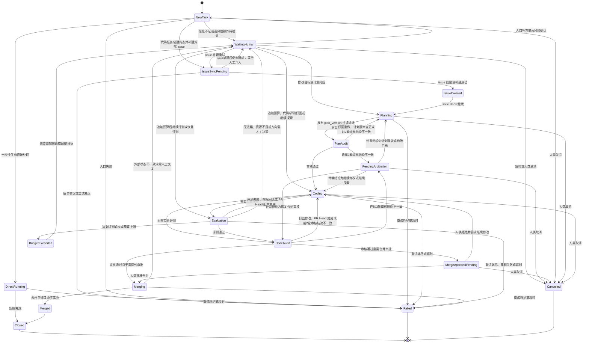
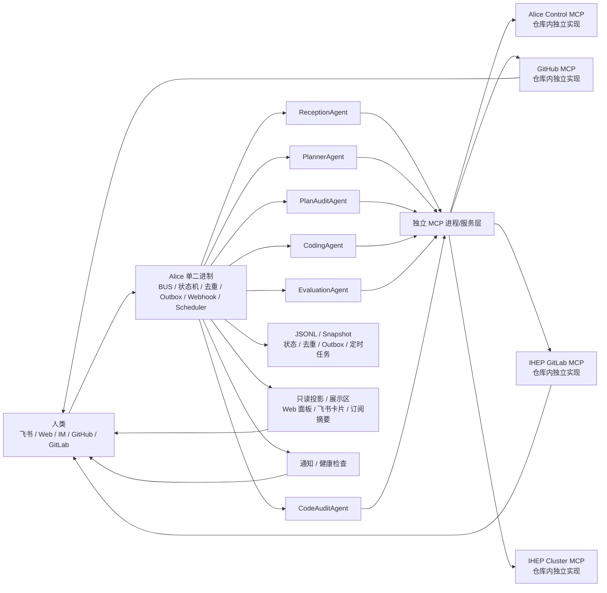

# Alice系统设计文档

**注意保持简洁，本文档是所有设计文档的最上层最抽象设计，不得太过细节！！！**

## 技术选型

使用go语言，第一版尽量不借助外部组件，可以使用外部库。Alice 核心 BUS、任务状态、Webhook、定时任务可以先内置在单二进制中，但各类 MCP 不应塞进这个主二进制；MCP 需要在本仓库内分别实现、分别构建，并以独立进程或独立服务运行。

第一版 BUS 先做成进程内核心组件。文中 `BUS` 统一指 Alice 的核心运行时，内部包含 `Event Bus`、`State Store`、去重、`outbox`、scheduler 和告警，而不是仅指消息队列本身。概念上保留两层：`Event Bus` 负责事件流转，`State Store` 负责真实状态和持久化，写状态必须经过 `State Store`，查询走只读视图，Agent 不直接改共享内存。状态事实来源采用追加事件日志，快照和只读视图只用于恢复与查询加速。

持久化先使用人类可读的 JSONL 追加日志，并配合周期性快照恢复状态；任务状态、已处理外部事件ID、待执行外部动作 `outbox`、定时任务都要持久化。第一版事件日志写入采用单 writer goroutine + 有界 channel 队列，避免多 goroutine 竞争同一文件锁；当写入队列同时超过按条数和字节配置的背压阈值时，BUS 暂停接收低优先级 webhook 和新任务，并返回可重试信号。背压期间低优先级事件可以被拒绝或延迟入队，同时持续告警，直到积压缓解。快照按“每 N 条事件或每 M 分钟，先到为准”触发；快照期间新事件继续追加日志，不阻塞 BUS。恢复时先加载最新快照，再重放后续 JSONL，并校验对象版本号。存储层除单条追加外还要预留批量刷盘、压缩和 compact 接口，后续可平滑切到 SQLite、BoltDB、Parquet 或压缩二进制段文件而不改变事件溯源语义。第一版恢复目标先按 `RPO <= 1 分钟`、`RTO <= 5 分钟` 设计。Agent 先以内置接口注册方式接入，后续可再拆分。

## 逻辑描述

BUS 核心运行时中的任务状态是系统真实状态，Issue、PR、评论主要作为人类协作界面和外部事件来源。
所有状态推进都要检查当前状态、目标版本和对象版本号；对象版本采用 `task_version` 单任务单调递增，主要用于乐观锁控制和单任务并发写保护；事件同时记录 `global_hlc` 和 `parent_event_id`，用于跨任务因果追踪与未来分布式扩展，第一版可先保留字段而不强依赖其驱动主流程。BUS 内部按 `task_id` 哈希分片到串行执行队列或等价单 goroutine 执行器，同一 `task_id` 任意时刻只允许一个处理单元消费事件，不允许多个Agent并发改同一个任务状态；当分片队列或单任务积压超过阈值时，BUS 进入背压，暂停接收低优先级新事件、对低优先级流量执行拒绝或延迟入队，并持续告警直到积压缓解。
所有外部事件都按“至少一次投递”处理，Webhook、评论、Review 必须有稳定外部事件ID并做幂等去重，去重记录要持久化并保留一段时间。Webhook 必须先验签，再入 BUS；验签失败直接丢弃并记录告警。
所有外部副作用操作都先写入本地持久化 `outbox`，再调用 MCP，完成后回写 BUS。`outbox` 记录至少区分 `pending` / `done` / `failed`；调用 MCP 时必须携带基于 `task_id:event_id:action_type` 的幂等键。该幂等键必须成为 MCP 协议契约的一部分，并通过 gRPC metadata、HTTP header 或等价显式字段传递。若 MCP 调用成功但 BUS 回写失败，重启后要扫描 `pending` 记录，优先核对外部状态并补写 BUS，避免漏操作或重复操作。
代码任务先在 BUS 创建内部 `task_id` 和状态，再通过 `outbox` 创建或补建外部 issue；在 issue 真正绑定成功前，任务停留在 `IssueSyncPending`，只有外部协作载体就绪后才进入 `IssueCreated`。
所有审核都绑定明确版本：计划审核绑定 `plan_version`，代码审核绑定 `pr_head_sha`，版本变更后必须重新审核。每轮审核都先创建绑定目标版本和轮次的 `AuditRequest`，其中固定本轮预期审核 Agent 集合、截止时间、聚合策略和心跳租约；截止时间可按任务类型、风险级别等策略配置给出默认值，例如 24 小时，也可由发起审核的 Agent 在策略允许范围内动态指定。审核 Agent 接单后必须先回写 `accepted`，随后定期发送“处理中”心跳。BUS 只有在收齐本轮 verdict、所有未完成审核席位都因心跳租约失效而按缺席处理、或截止时间到达后才聚合结论，避免单个 Agent 崩溃导致活锁；迟到 verdict、旧轮次 verdict、版本不匹配 verdict 只保留审计，不改主状态。BUS 需要分别维护计划审核和代码审核的轮次计数，并持久化保留跨重启状态；审核意见不一致时默认按不通过打回，若连续 3 轮修改后仍然意见不一致，再升级为人工仲裁。
需要实验验证的任务由策略层标记 `requires_evaluation`；这类任务在 Coding 后先进入 `Evaluation`，对指定 `pr_head_sha` 跑评测，记录数据集/配置/基线版本与指标结果，只有评测完成后才进入代码审核。`EvalSpec` 由 Planner 在计划阶段生成并挂到 Task 上下文，至少包含通过阈值、`max_iterations`、预算上限、资源规格、随机种子策略、镜像摘要和数据集版本；BUS 在发起评测时将当前 `pr_head_sha` 与 `EvalSpec` 绑定为具体评测请求；`EvalResult` 由 EvaluationAgent 执行后回写并关联 `task_id` 与 `pr_head_sha`。当预算剩余小于 0 或达到硬上限时，BUS 必须立刻停止新的 `Coding` / `Evaluation` 投递并进入 `BudgetExceeded`；已运行的评测作业默认通过 Cluster MCP 发起终止。评测是客观执行步骤，代码审核只消费评测结论与产物，不负责发起重型 GPU 实验。
系统自己发出的 issue 评论、PR、Review 和状态变更请求，在 `outbox` 和回流事件中都要带 `origin_actor`、`causation_id` 等关联元数据；回流 webhook 若识别为 Alice 自己触发的回执，只用于确认外部副作用和同步镜像状态，不再次触发同类 Agent 开工。
高风险副作用操作（修改设置、记忆、定时任务、集群操作、合并 PR）必须先做身份校验；身份来源统一映射到内部 `alice_user_id`，并记录飞书、Web、GitHub、GitLab 等外部身份绑定，必要时要求更高权限或 MFA 校验。所有来自 issue、评论、飞书消息和 Web 表单的自然语言输入都视为不可信数据，`ReceptionAgent` 只负责提取候选意图，真正的高风险动作必须经过策略层二次校验，必要时再走确认流程，不能直接把用户文本当执行指令。`confirmation_token` 由 CSPRNG 生成，并绑定 `task_id`、`action_hash`、确认人身份、鉴权快照和过期时间，通过飞书卡片等渠道发给指定用户，默认 10 分钟有效；确认或拒绝都作为外部事件回流 BUS，令牌单次使用后立即失效，超时后自动失效并进入 `WaitingHuman` 或 `Cancelled`。高风险操作默认要求确认人与申请人不同，或具备更高权限级别。哪些操作需要审批、审批人和超时由策略配置决定。
`WaitingHuman` 仍保持为顶层汇合状态，但必须携带明确的 `waiting_reason` 子标记与优先级，至少区分 `WaitingInput`、`WaitingConfirmation`、`WaitingBudget`、`WaitingRecovery`。人类短时间内发来的多条修改请求要生成 `coalescing_key`，若前一条同类请求尚未处理，BUS 可以按策略覆盖或合并，避免任务反复重启。`PendingArbitration` 用于连续多轮审核分歧后的人工仲裁；`MergeApprovalPending` 用于代码审核通过后等待合并审批。人类可通过飞书卡片或 Web 后台给出通过、打回、修改目标、追加预算或取消；结论回写 BUS 后，可根据决策恢复到 `Planning`、`Coding`、`Evaluation` 或其他对应阶段继续流转。
所有涉及仓库、凭据、系统设置的Agent都运行在受限沙箱中，通过MCP访问外部系统。`DirectRunning` 使用轻量查询沙箱，允许联网但不允许持久化写盘；`Coding` 默认禁止非必要外网，严格限制文件系统、CPU、内存和磁盘；`Evaluation` 通过受控作业环境访问 CPU/GPU 资源，并默认网络隔离，只允许访问白名单制品、模型和数据源；进入 `Evaluation` 前需要经过基础静态扫描与策略校验，拦截明显危险的网络外发、任意命令执行和越权系统调用。MCP 执行器按最小权限原则运行，避免形成沙箱逃逸链；不同 MCP 按域拆分为独立进程或服务，分别部署、分别升级，不与 Alice 核心 BUS 链接成同一可执行文件。
BUS 定期探测 MCP 健康状态，并为每个 MCP 维护独立心跳、限流状态和断路器；同机通信优先 Unix Domain Socket，跨机优先 gRPC。任一 MCP 异常时，只暂停依赖该 MCP 的新任务并告警，恢复后自动重试积压任务；例如 GitHub MCP 崩溃不应误杀已经在 Cluster MCP 上运行的评测作业。
定时任务在 BUS 中保存为 `ScheduledTask`，由内置 scheduler 到点触发生成普通任务。scheduler 需要持久化最近触发时间，启动时补偿错过窗口，至少保证一次触发，具体任务仍需幂等。
BUS 还需要周期性执行自检巡检，扫描长时间未完成的 `outbox`、审核和外部作业，主动核对外部真实状态并补写回 BUS，避免形成幽灵任务。
系统需要提供独立的展示区，优先通过 Web 只读面板承载全局查看，通过飞书卡片/订阅消息承载主动推送。展示区只读取 BUS 导出的只读投影，不直接读取或修改 BUS 内存状态。至少要能看到任务进度、当前活动任务、BUS 健康状态、MCP 健康状态、队列积压、每任务与全局的 token 消耗、模型调用成本、评测资源消耗和预算剩余。

## 核心对象

- `Task`: `task_id`、`trace_id`、来源、类型、当前状态、`waiting_reason`、`task_version`、风险级别、重试次数、超时、关联 issue/PR、当前活动 issue/PR 引用、活动取消令牌
- `ExternalEvent`: `event_id`、`parent_event_id`、`global_hlc`、事件类型、来源、关联 `task_id`、`origin_actor`、`causation_id`、`coalescing_key`、原始负载引用、去重保留时间、验签结果
- `OutboxRecord`: `action_id`、`task_id`、动作类型、目标对象引用、幂等键、状态、尝试次数、下次重试时间、最后错误
- `PlanArtifact`: `task_id`、`plan_artifact_id`、`plan_version`、计划摘要
- `AuditRequest`: `task_id`、审核目标类型、目标版本、审核轮次、预期审核Agent集合、截止时间、聚合策略、心跳租约
- `AuditRecord`: `task_id`、审核目标类型、目标版本、审核轮次、审核Agent、结论、结构化理由摘要、证据引用
- `EvalSpec`: `task_id`、`eval_spec_id`、数据集/配置版本、基线版本、通过阈值、`max_iterations`、预算上限、资源规格、随机种子策略、镜像摘要；由 Planner 生成
- `EvalResult`: `task_id`、`eval_spec_id`、目标 `pr_head_sha`、执行环境、指标摘要、基线对比、产物引用、结论；由 EvaluationAgent 生成
- `Confirmation`: `confirmation_token`、`task_id`、申请人、确认人、投递渠道、`action_hash`、鉴权快照、过期时间、状态
- `IdentityBinding`: 内部 `alice_user_id`、外部身份映射、权限级别、MFA 状态
- `CancellationToken`: `task_id`、令牌值、作用域、签发时间、撤销时间、撤销原因
- `PRArtifact`: `task_id`、`pr_id`、`pr_head_sha`、状态（`active` / `superseded` / `merged`）、可合并性摘要
- `ScheduledTask`: 调度ID、CRON/时间表达式、目标动作、启用状态、下次触发时间、最近触发时间
- `UsageLedger`: `task_id`、阶段、Agent/模型/MCP、输入输出 token、缓存 token、估算成本、资源用量、预算上限、预算剩余、更新时间；用于预算追踪、超支熔断与展示区汇总
- `OpsReadModel`: BUS 状态摘要、任务列表、当前活动任务、队列积压、MCP 健康、告警、预算与 token 汇总；用于导出只读投影，供 Web/飞书展示区读取

### 入口信息触发

由人类新发进Alice系统的信息处理方法
基本逻辑：飞书信息、网页后台、其他IM信息接入 -> BUS -> ReceptionAgent（例如Kimi Code）
ReceptionAgent只负责识别任务类型、风险分级和上下文整理；是否允许调用工具、是否需要审批，由 BUS 内策略层裁决。所有入口任务都先进入 BUS，不允许绕过 BUS 直接做外部副作用；来自用户的自然语言内容只作为候选意图来源，不能直接提升权限或覆盖系统策略。
- 可一次性处理的任务：直接处理
  - 运行在轻量查询沙箱中，允许联网，不允许持久化写盘
  - 联网查询 -> 直接完成，结果写回 BUS，由飞书回复消费
  - 修改设置 -> 走 MCP 工具，底层通过 BUS 执行；高风险操作需要鉴权，必要时二次确认
  - 记忆修改 -> 走 MCP 工具，底层通过 BUS 执行；高风险操作需要鉴权，必要时二次确认
  - 定时任务发布 -> 写入 `ScheduledTask`，由 BUS scheduler 统一触发；高风险操作需要鉴权，必要时二次确认
  - 查询用量 -> 走 MCP 工具，底层通过 BUS 执行
  - 信息不足或风险过高 -> 不直接执行，进入等待人类补充或确认
- 需要异步处理的代码任务：
  - 先在 BUS 中创建任务状态和 `task_id`，进入 `IssueSyncPending`
  - 再通过 `outbox` 创建或补建外部 issue；成功绑定后进入 `IssueCreated`
  - 人类连续发来的同类修改请求在进入执行前可按 `coalescing_key` 合并，避免 Planner / Coding 反复被抖动重启
  - issue、评论、PR、Review 都回写同一个 `task_id`，但只有与当前活动 issue/PR、当前审核轮次和当前版本匹配的事件才能推进主状态
  - 由后续 issue hook 触发执行，但仍以 BUS 状态为准

### 代码Issue触发

由人类或自动过程产生的新issue或issue的回复的处理过程

GitHub、GitLab issue -> BUS -> PlannerAgent （例如Codex-5.3 xhigh）

完整的阅读代码以及对应的Issue，给出完善的修改与更新计划，使用MCP工具回复Issue并请求审核。对于实验类任务，计划中要明确是否需要 `Evaluation`、使用什么数据集和配置、和哪个基线比较、什么指标算通过，并由 Planner 产出对应 `EvalSpec` 写入 Task 上下文。
Alice 自己写回 issue 的评论在 webhook 回流后，只用于确认评论已落地和同步外部镜像，不再次触发 Planner 重跑。
对于审核意见，如果不通过要再次进行回复，再次请求审核；对于通过的，使用工具向BUS提交绑定 `plan_artifact_id` 和 `plan_version` 的PR代码编写请求。

### 审核需求触发

#### 计划审核
GitHub、GitLab issue 审核请求 -> BUS -> PlanAuditAgent

这里使用Codex、KimiCode这类Agent，也可以接入DeepSeek这种纯语言模型，PlanAuditAgent独立对指定 `plan_version` 给出审核，提出审核意见，给予通过或者打回。每轮计划审核都由 BUS 先生成 `AuditRequest`，固定本轮审核 Agent 集合、截止时间和心跳租约；Agent 接单后必须定期汇报处理中状态，心跳超时的席位按缺席处理，避免审核轮次被单点卡死。多个审核结论不一致时，默认按“不通过”处理并打回 Planner 重做，同时累积该阶段轮次；如果连续 3 轮修改后仍然意见不一致，再升级为人工仲裁。

#### 代码审核

GitHub、GitLab issue 审核请求 -> BUS -> CodeAuditAgent

这里使用Codex、KimiCode两个CodeAuditAgent独立对指定 PR 和 `pr_head_sha` 做代码审核，提出审核意见，给予通过或者打回。每轮代码审核都由 BUS 先生成 `AuditRequest`，固定本轮审核 Agent 集合、截止时间和心跳租约；BUS 只在收齐本轮 verdict、心跳租约失效后的缺席席位完成判定、或截止时间到达后聚合。审 PR 是否符合计划、CI/测试/分支保护是否满足并可合并。多个审核结论不一致时，默认按“不通过”处理并打回 Coding 修改，同时累积该阶段轮次；如果连续 3 轮修改后仍然意见不一致，再升级为人工仲裁。
旧轮次 verdict、旧 `pr_head_sha` verdict、来自 superseded PR 的 Review 或评论，只做审计和镜像同步，不得推进当前代码审核状态。
代码审核通过后，不直接等价于已合并；BUS 还要根据仓库策略进入 `MergeApprovalPending` 或 `Merging`，完成审批和实际合并动作后才进入 `Merged`。

### Coding Agent

根据PR代码编写请求，进行并行编码，创建或更新该 `task_id` 的唯一活动 PR。同一个 `task_id` 同时只允许一个活动 Coding 轮次和一个活动 PR，避免重复开工或多个活跃 PR 并行推进。若因平台策略必须新开 PR，BUS 要先将旧 PR 标记为 `superseded`，切换 `active_pr_ref`，旧 PR 后续 webhook 只保留审计，不再驱动当前轮状态机。状态回退到 `Planning`、进入 `Cancelled` 或触发硬熔断时，BUS 必须撤销当前 `CancellationToken` 并级联通知正在运行的 Coding / Evaluation / MCP 请求取消。必要时可以在进入评测或审核前自动同步主干并更新 `pr_head_sha`，但一旦版本变化必须重新评测、重新审核；如果更新 PR 时遇到远端分支非快进变化，应优先自动 rebase，只有在无冲突时才继续，发生冲突则回退到 `Coding` 解决，禁止 force push 覆盖历史。
如果任务需要 `Evaluation`，则由 BUS 基于 `EvalSpec` 发起评测；如果不需要，则直接请求代码审核。对于审核或评测意见，如果不通过要再次进行回复，再次请求评测或审核；对于通过的，只有在代码审核通过且 CI/分支保护满足后，才进入合并审批或合并执行，完成后关闭 issue，通知人类。

### Evaluation Agent

GitHub、GitLab PR 评测请求 -> BUS -> EvaluationAgent

`EvaluationAgent` 负责对指定 `pr_head_sha` 按 Task 上下文中的 `EvalSpec` 触发实验，通常通过 IHEP Cluster MCP 申请预留或受控分配的 GPU/CPU 资源、提交作业、等待结果、收集指标与产物，并与基线比较。评测结论以结构化结果回写 BUS：通过则进入代码审核，不通过或指标劣化则打回 Coding；如果 `pr_head_sha`、数据集版本或评测配置发生变化，旧评测结果立即失效并重新评测；如果达到 `max_iterations`、预算上限或资源策略上限，则进入预算决策；如果长期无进展、资源不足或方向明显需要人工调整，则进入 `WaitingHuman`。当任务被取消、回退或超预算时，EvaluationAgent 必须通过 Cluster MCP 终止已提交但不再需要的作业，并在 BUS 中回写清理结果，避免 GPU/CPU 资源泄露。

## 状态机

补充规则：
- `WaitingHuman` 不是无类型堆积队列，必须始终携带 `waiting_reason`，至少区分输入补充、风险确认、预算决策和恢复处理，并按优先级展示与通知；连续审核分歧仍走 `PendingArbitration`。
- 人类在 `WaitingHuman` 中给出结论后，BUS 应按最新上下文恢复到最小必要阶段；若代码未变化且只是追加预算、恢复资源或继续当前评测，允许直接回到 `Evaluation`。
- `IssueSyncPending` 采用指数退避重试，第一版建议间隔 `1m / 2m / 5m / 10m / 30m`，最大 5 次；若外部返回 403、404 这类明确致命错误，应立即进入 `Failed`，而不是继续重试。
- 任何状态回退到 `Planning`、进入 `Cancelled` 或触发预算硬熔断时，都必须撤销活动 `CancellationToken`，级联取消仍在运行的 LLM 调用、PR 更新和评测作业。

## 架构图

## 典型案例

### 案例中的人类修改请求如何进入

无论任务当前处于哪个阶段，人类新的修改请求、本轮补充说明、方向调整或追加约束，本质上都先作为新的外部事件进入 BUS，再由 BUS 判断这是“同一任务的变更”还是“应该拆成新任务”。

统一原理：
1. 人类可以通过飞书消息、issue 评论、PR 评论、Web 后台操作等入口提交修改请求。
2. 入口层先把它写成新的 `ExternalEvent`；如果能明确命中已有 `task_id`，则作为该任务的新事件串行处理，否则创建新任务。短时间内的同类修改请求可以按 `coalescing_key` 合并或覆盖，避免 Agent 被无意义反复拉起。
3. BUS 根据修改影响范围决定恢复到哪个阶段：
   - 只改结果表达、补充小约束、不改变计划边界：保持当前主流程或回到当前阶段重做。
   - 改变需求边界、成功标准、数据集、评测指标、资源预算：回到 `Planning` 或进入 `WaitingHuman`。
   - 只对当前实现提出明确修改意见：回到 `Coding`。
   - 已经触发的旧审核、旧评测、旧 PR 若与新请求不再匹配，只保留审计，不再推进主状态。
4. 一旦发生回退，BUS 要撤销旧的 `CancellationToken`，主动取消已发出的 LLM 调用、PR 更新和评测作业，避免旧资源继续消耗。
5. 如果修改请求与当前任务目标差异过大，策略层可以拒绝并拆成新 `task_id`，避免一个任务被无限漂移。

### 案例1：查询今日天气

这是简单任务，不需要异步代码流程，也不需要审核。

运行流程：
1. 人类在飞书里发消息“查询今日天气”。
2. 消息接入 BUS，生成一个简单任务，交给 `ReceptionAgent`。
3. `ReceptionAgent` 识别为低风险即时查询任务，调用模型自带联网查询能力获取天气结果。
4. 查询结果回写 BUS，并由飞书回复通道发送给人类。
5. 任务直接进入 `Closed`。

如果中途有人类修改请求：
1. 例如人类马上补一句“改查上海明天的天气”。
2. 这条消息作为新的入口事件进入 BUS；如果前一个天气任务尚未 `Closed`，则可绑定原 `task_id`，由 `ReceptionAgent` 用新约束覆盖旧查询目标。
3. 系统取消旧查询结果的继续发送或将其标记为过期，再按新条件重新查询并回复。
4. 如果原任务已经 `Closed`，则直接创建一个新的简单任务处理。

对应路径：
`Human -> BUS -> ReceptionAgent -> 联网查询 -> BUS -> 飞书回复 -> Closed`

### 案例2：修改代码中的明确问题或增加新功能

这是标准代码任务，通常需要计划、编码和代码审核；如果变更不依赖实验指标，可以不进入 `Evaluation`。

运行流程：
1. 人类在 GitHub/GitLab issue 或飞书中描述一个明确 bug，或者提出一个新功能需求。
2. BUS 先创建 `task_id` 并进入 `IssueSyncPending`；外部 issue 绑定成功后进入 `IssueCreated`，再触发 `PlannerAgent` 阅读代码与需求，产出修改计划。
3. `PlanAuditAgent` 审核计划；通过后，BUS 发起编码请求。
4. `CodingAgent` 实现修改、提交分支、创建或更新唯一活动 PR，并把当前 `pr_head_sha` 回写 BUS。
5. 如果该任务不需要实验验证，直接进入 `CodeAuditAgent`；如果代码审核不通过，则打回 `CodingAgent` 修改后再次审核。
6. 代码审核通过且 CI、分支保护满足后，若仓库策略要求审批，则先进入 `MergeApprovalPending`；审批通过后进入 `Merging`，由 BUS 调用仓库 MCP 合并 PR、关闭 issue、通知人类。
7. 任务进入 `Merged -> Closed`。

如果中途有人类修改请求：
1. 人类可以通过 issue 评论、PR 评论、飞书卡片或 Web 后台说“顺手把这个接口名也改掉”或“这个功能范围再加一个按钮”。
2. 新请求进入 BUS 后，若仍属于同一 `task_id`，系统先判断是否改变计划边界：
   - 若只是明确的小改动，直接回到 `Coding`，并让当前活动 PR 继续演进。
   - 若改变需求边界、验收标准或实现方案，则回到 `Planning`，旧计划、旧审核结论失效，重新走计划审核。
3. 如果请求到达时任务已经在 `CodeAudit`、`MergeApprovalPending` 或 `Merging`，BUS 要先冻结后续自动推进，撤销旧 `CancellationToken`，再根据变更范围回退到 `Coding` 或 `Planning`。
4. 如果当前活动 PR 在更新时遇到远端非快进变更，系统先尝试自动 rebase；无冲突则继续，发生冲突则回到 `Coding` 解决，禁止通过 force push 强行覆盖远端历史。
5. 若这条修改与原任务目标差异过大，例如从“修 bug”变成“重构整套模块”，则应拆成新任务，而不是继续污染原 `task_id`。

对应路径：
`Human/Issue -> BUS -> IssueSyncPending -> IssueCreated -> PlannerAgent -> PlanAuditAgent -> CodingAgent -> CodeAuditAgent -> MergeApprovalPending/Merging -> Closed`

### 案例3：科研探索任务，给定指标要求，需要反复进行 GPU、CPU 运算实验达到最优

这是探索型任务，核心特征不是一次编码后直接审核，而是围绕目标指标反复执行 `Coding -> Evaluation -> Coding`。`Evaluation` 是主流程的一部分，不应塞进审核。

运行流程：
1. 人类提交科研目标，例如“在指定数据集上把某个指标提升到阈值以上，允许使用 GPU/CPU 反复实验”。
2. BUS 先创建 `task_id` 并完成 issue 绑定，然后 `PlannerAgent` 产出探索计划，明确评测指标、数据集版本、基线版本、允许使用的资源、停止条件和成功标准。
3. `PlanAuditAgent` 审核探索计划；通过后，BUS 发起第一轮编码。
4. `CodingAgent` 修改算法、训练脚本、参数或实验编排代码，更新该 `task_id` 的唯一活动 PR，并回写新的 `pr_head_sha`。
5. BUS 根据 `EvalSpec` 触发 `EvaluationAgent`，通过 IHEP Cluster MCP 或其他执行环境发起 GPU/CPU 实验，收集指标、日志、模型产物，并与基线比较。
6. 如果指标未达标、结果劣化、波动超阈值，或者实验配置需要调整，则 BUS 将结果打回 `CodingAgent`，进入下一轮实现与实验。
7. 如果达到 `EvalSpec.max_iterations`、预算上限，或出现长期无进展、资源不足等情况，则任务进入 `BudgetExceeded -> WaitingHuman` 或直接进入 `WaitingHuman`，由人类决定是否追加预算、调整目标或停止；若触发预算硬熔断，BUS 还要终止已经启动但不再允许继续的评测作业。
8. 只有当 `Evaluation` 给出通过结论后，任务才进入 `CodeAuditAgent`；代码审核重点检查实现是否与计划和评测结论一致，而不是亲自重跑重型实验。
9. 审核通过后再进入合并审批/执行；如果这是纯科研探索而不是要合入主干，也可以由策略层配置为“产出报告并关闭任务”，不强制 merge。

如果中途有人类修改请求：
1. 人类可能会追加“把主指标从 AUC 改成 F1”“预算再加 200 GPU 小时”“不要再搜这个方向，改试另一个 baseline”。
2. 这类请求进入 BUS 后，通常不会只回到 `Coding`，而是先判断它是否修改了 `EvalSpec` 或成功标准：
   - 改评测指标、数据集、预算、停止条件：回到 `Planning` 或进入 `WaitingHuman`，重新确认新的探索目标。
   - 只是在当前方向上补充一个明确实验建议：可直接回到 `Coding` 或 `Evaluation` 前准备阶段。
3. 一旦人类修改了 `EvalSpec`、预算或目标版本，当前轮评测结果、旧审核结论和不再匹配的实验产物都只保留审计价值，不再作为通过依据。
4. 如果人类要求“停止当前探索，先输出阶段报告”，则 BUS 应终止新的实验投递、撤销旧 `CancellationToken`，并清理已提交的集群作业，把任务转成报告/等待决策路径，而不是继续自动消耗 GPU/CPU 资源。

对应路径：
`Human/Issue -> BUS -> IssueSyncPending -> IssueCreated -> PlannerAgent -> PlanAuditAgent -> CodingAgent -> EvaluationAgent -> CodingAgent ... -> EvaluationAgent -> CodeAuditAgent -> MergeApprovalPending/Merging 或 Report -> Closed`

补充约束：
- 探索类任务必须记录每轮实验的 `pr_head_sha`、数据集版本、评测配置、资源用量、指标结果和产物引用，保证可追溯；同一 `task_id` 只保留一个活动 PR，旧 PR 若被替换必须标记为 `superseded`。
- 如果连续多轮实验没有进展、预算耗尽、集群资源不足或方向明显错误，应进入 `WaitingHuman`，由人类决定继续、调整目标还是结束任务。

## MCP 工具

所有 MCP 都需要在本仓库内实现，优先复用仓库里已有实现；若当前仓库没有现成实现，则需要在仓库内补齐。MCP 不与 Alice 核心 BUS 编译成同一个二进制，而是按能力域拆分为独立进程或独立服务，但语义保持一致。所有 MCP 都要有统一的超时、重试、错误码和健康检查语义，且超时层级满足 `BUS > MCP > 底层 API`。同机部署时优先使用 Unix Domain Socket，跨机部署时优先使用 gRPC，避免 HTTP/1.1 队头阻塞。所有会产生外部副作用的 MCP 接口都必须在协议层显式携带幂等键，并将其作为契约字段透传到底层执行器。仓库凭据优先使用可轮换的短期凭据或 GitHub App / GitLab App 模式，不建议长期人工 Token。每个 MCP 都通过能力白名单约束允许的仓库、操作、队列、费用上限和速率上限；BUS 需要为每个 MCP 单独维护断路器与恢复逻辑，单个 MCP 崩溃不能拖垮其他能力域。

1. 联网查询：这个是kimiCode或者Codex自带的，不需要实现
2. Alice Control MCP: 用来控制Alice系统自己的，例如修改记忆修改设置等等。
3. IHEP Cluster MCP: 用来控制IHEP GPU计算集群
4. GitHub MCP: 创建Issue、评论、创建PR、读取CI和可合并状态、合并审核PR
5. IHEP GitLab MCP: 在GitLab仓库创建Issue、评论、创建PR、读取CI和可合并状态、合并审核PR

## 展示区

展示区是面向人类的观察与决策界面，不参与主状态推进。第一版建议采用“Web 面板为主、飞书卡片与订阅消息为辅”的双通道方案。

设计原则：
1. Web 面板负责全局查看、筛选、检索和历史回放。
2. 飞书负责主动推送当前进展、异常告警、预算提醒、审批卡片和任务摘要。
3. 展示区只读 `OpsReadModel`，不直接改 BUS 内存；需要人工动作时，仍通过显式按钮/表单回写成新的外部事件。

至少展示：
1. 当前活动任务列表：`task_id`、来源、当前阶段、负责人/当前 Agent、最近更新时间、阻塞原因。
2. 单任务详情：状态流转、当前 issue/PR、当前审核轮次、当前 `plan_version` / `pr_head_sha`、评测进度、最近日志摘要、当前 `waiting_reason`。
3. BUS 状态：事件吞吐、分片队列积压、死信数量、快照时间、恢复状态。
4. MCP 状态：各 MCP 健康、最近错误、限流状态、不可用时长。
5. 用量与预算：每任务和全局的输入输出 token、缓存 token、模型费用、GPU/CPU 资源消耗、预算上限、预算剩余、超预算风险。
6. 人工待处理项：待审批、待仲裁、待补充信息、待恢复任务，并按 `waiting_reason` 和优先级排序。

飞书侧建议：
1. 支持按任务订阅进度卡片，展示当前阶段、最近一次状态变化、token/预算消耗和下一步动作；所有可执行按钮都必须携带 `confirmation_token` 或等价幂等键。
2. 对长任务定期推送摘要，而不是只在失败时告警。
3. 当任务进入 `WaitingHuman`、`PendingArbitration`、`MergeApprovalPending` 或预算接近阈值时，主动推送可操作卡片。
4. 如果卡片对应的任务状态已经变化，卡片必须自动刷新为“已失效”或“已处理”，不能继续接受重复操作。

## 运行与工程约束

- 日志使用结构化 JSON，关键字段至少包含 `task_id`、状态、外部对象引用、错误原因、`event_id`、`parent_event_id`
- 暴露健康检查和基础指标，至少覆盖存储、BUS、MCP 连通性、任务积压和失败率
- 每个任务都要保留 `trace_id`；关键状态转换要可追踪，便于导出执行链路和排错
- 告警通过飞书发送，至少带 `task_id`、阶段、失败摘要、建议动作；通知按 Info、Warning、Critical 分级
- 人工审核、仲裁、确认、驳回优先通过飞书卡片 + 按钮完成，按钮动作回写 BUS；Web 管理页至少要能查看任务状态、执行轨迹、当前活动任务、BUS/MCP 健康、token 消耗、模型费用、预算使用和人工待处理项，并支持人工批准、驳回、重试
- 配置通过环境变量或配置文件外置，并支持热更新；凭据不写入日志，不硬编码在仓库里
- 每类 Agent 都要有资源配额，可通过 goroutine 池、并发信号量、超时控制或令牌桶等方式实现，至少限制最大执行时间、最大 token 消耗和最大磁盘写入
- 审核 Agent 接单后必须按租约上报心跳；BUS 对缺席审核席位按超时缺席处理，不允许无限等待单个 verdict
- 同一 `task_id` 默认只允许一个活动 PR；如必须切换 PR，旧 PR 必须先标记为 `superseded`，随后其 webhook 不再推进当前主状态机
- PR 更新遇到远端非快进变更时，只允许自动 rebase 或回退到 `Coding` 解决冲突；禁止 force push 覆盖远端审核历史
- `outbox` 已完成记录默认保留 7 天后再归档，便于审计和恢复核对
- `outbox` 与事件日志写入使用单 writer goroutine + 有界队列；背压阈值至少同时按条数和字节配置
- 各类 MCP 必须在本仓库内有明确源码目录、独立构建入口和独立部署单元；Alice 核心 BUS 只依赖它们的协议契约，不把它们静态编进主二进制
- BUS 必须维护每个 MCP 的独立断路器、重试预算和健康视图；单个 MCP 故障只影响依赖该 MCP 的新请求，不应误杀其他域中已运行的作业
- token 用量、模型费用、GPU/CPU 资源用量和预算消耗必须按任务、按阶段、按模型/MCP 维度持续累计，并导出到展示区和告警系统
- 当预算剩余小于 0 时，必须立刻进入硬熔断：暂停新的 `Coding` / `Evaluation`，并按策略终止仍在运行的评测作业
- 评测任务必须可复现，至少记录 `pr_head_sha`、数据集版本、评测配置、随机种子策略、容器镜像摘要、GPU 规格、指标摘要和产物引用；同一版本的评测结果要可追溯，数据集版本应尽量使用内容寻址或等价不可变版本标识
- `Evaluation` 环境默认网络隔离，只开放白名单依赖；进入评测前要做基础静态扫描和策略校验，阻断明显危险的外发与越权执行
- 高风险确认必须记录创建时的权限级别和 MFA 鉴权快照；确认时要校验令牌、快照和当前身份的一致性
- 人类修改请求在短时间窗口内要支持合并或覆盖，避免同一任务被评论风暴反复抖动
- 审核、仲裁和拒绝结论应保留结构化理由摘要、证据引用和模型/策略元数据，便于人类理解与复盘；不要求保留模型内部 chain-of-thought
- 状态机回退或取消时必须传播 `CancellationToken` 到 Agent 与 MCP 层，确保 LLM 请求、PR 更新和集群作业能被真正取消
- 定期执行自检巡检，扫描超过 30 分钟仍为 `pending` 的 `OutboxRecord` 或外部作业，并主动与 GitHub / GitLab / Cluster 等外部系统对账
- MCP 需要 mock 实现；状态机迁移、去重恢复、`outbox` 恢复都必须可测试

## 异常处理

对于异常，有的可以容忍，有的要及时上报
- 模型的网络连接异常
- 集群存储故障
- 每个阶段都有重试上限和超时；超时后进入 `Failed` 或 `WaitingHuman`
- BUS 回写失败优先重试，不能只把外部 side effect 当成功
- Webhook、评论、Review 重复投递时按幂等处理，不能重复建任务、重复开 PR、重复合并
- Alice 自己发出的评论、Review、PR 变更在 webhook 回流后只能更新回执与镜像状态，不能再次触发同类 Agent 开工
- Webhook 验签失败直接丢弃、记录审计日志并告警
- Webhook 或外部事件重试耗尽后进入死信队列，等待人工处理；人工可查看原始 payload，选择丢弃、重试或修复后标记完成，所有动作都要留审计日志
- 已处理事件ID、确认令牌要持久化，并设置合理保留时间
- issue、PR、评论已发出但 BUS 未写回时，要依靠 `outbox` 的 `pending` 记录做补写或对账恢复，并及时上报
- issue 创建/补建失败时，任务应停留在 `IssueSyncPending` 或进入 `WaitingHuman`，不能错误宣称已进入 issue 驱动流程；重试采用指数退避，403/404 等致命错误立即失败
- MCP 健康检查失败、API 限流、凭据失效时，暂停相关任务并上报
- 主模型不可用时可按预设优先级降级到备用模型，并使用熔断器避免频繁抖动；恢复后再自动探测切回。无法降级时再失败
- 集群排队过长、GPU 不足、评测作业失败或指标波动超出阈值时，不能跳过 `Evaluation` 直接进入审核
- 预算记账延迟不能成为超支理由；一旦触发预算硬熔断，新的编码和评测请求必须停止，已启动的评测作业要进入取消或人工恢复流程
- BUS 重启后要主动扫描长时间 `pending` 的 `outbox` 和外部作业，核对 PR、issue、集群作业真实状态，修复幽灵任务而不是被动等待 webhook
- 旧审核轮次 verdict、旧版本 verdict、来自 superseded PR 的 CI/评论/Review 只能记录审计，不能污染当前主状态机
- 合并审批超时、审批被拒或 `Merging` 过程中出现外部状态不一致时，要进入 `MergeApprovalPending`、`WaitingHuman` 或恢复流程，不能直接假设任务已 `Merged`
- 审核版本不一致、CI 未通过、分支保护不满足时，不能继续合并
- 飞书卡片按钮、Web 审批按钮必须做幂等去重；重复点击或过期卡片只能返回“已处理/已失效”，不能重复触发合并、取消或审批
- 自然语言入口要防提示词注入；用户文本只能影响候选意图和上下文，不能绕过权限、确认或策略检查
- 还有很多我预料不到的但是你在执行中会遇到的问题
- 当你花费了很多时间精力之后，不一定要解决，形成报告及时上报很重要
- 做周期性自检巡检
- 出现问题要及时在飞书发at消息通知我
