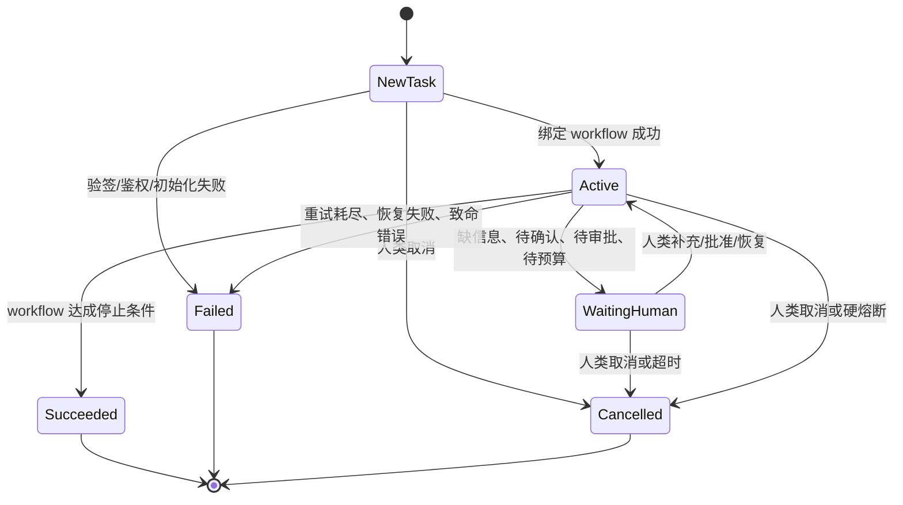

# Alice 系统设计文档

**保持简洁：这是顶层设计文档，只定义边界、契约和一版落地方式，不展开具体 Skill 或 Workflow 内容。**

## 设计目标

Alice 采用 `thin kernel + declarative workflow + external adapters` 模式。

目标：
- 主二进制尽量小，只保留安全、审计、状态和调度内核。
- 任务流程尽量外置到 versioned workflow spec，而不是写死在 Go 代码里。
- 外部副作用统一走 MCP，不允许执行实例绕过 BUS 直接改外部系统。
- agent skill 和 workflow 可以频繁调整，但权限上界、审批规则、预算和审计必须稳定。

非目标：
- 不在核心里写死“代码任务一定要 Planning -> Coding -> Review -> Merge”。
- 不把 prompt 文本直接当程序；workflow 必须有机器可校验的 manifest。

## 技术选型

- 核心 BUS 使用 Go，第一版可以是单二进制、进程内 Event Bus。
- 持久化先使用 JSONL 追加日志 + 周期性快照；追加日志负责 durability，快照主要服务恢复速度；后续可切到 SQLite 或其他存储，但事件语义不变。
- MCP 必须按能力域拆成独立进程或服务，分别构建、分别部署、分别升级，不静态编进 BUS。
- 第一版目标分开定义：日志刷盘/复制策略负责 `RPO <= 1 分钟`，快照与重放速度负责 `RTO <= 5 分钟`。

## 核心原则

1. **核心只管生命周期，不管业务剧本。**  
   BUS 固定任务生命周期、鉴权、预算、审批、审计、幂等、重试、取消和对外副作用契约；不固定具体业务阶段名称和顺序。

2. **workflow 外置。**  
   `Planning`、`Coding`、`Evaluation`、`Audit`、`Merge`、`Report` 这类步骤都应由 workflow manifest 声明；主程序不内建这些阶段。

3. **manifest 先于 prompt。**  
   workflow 至少分两层：
   - `manifest`：阶段图、输入输出 schema、审批 gate、能力槽位、停止条件、回退规则
   - `prompt/template`：给 leader 和 sub agent 的说明文本

4. **所有外部副作用都走 `outbox + MCP`。**  
   issue、PR、评论、合并、集群作业、记忆修改、设置修改、定时任务发布都不能绕过 BUS。

5. **agent skill 和 workflow 分开。**  
   `Skill` 只指 agent 可读的能力包；`Workflow` 只指 BUS 管理的受控流程契约。前者服务于 agent 执行，后者服务于系统编排、审计和恢复。

## BUS 内建边界

BUS 主二进制只内建这些能力：

- 外部事件接入、验签、幂等去重、死信处理
- 事件日志、状态存储、快照恢复、只读投影
- `EphemeralRequest` 路由、`PromotionDecision` 裁决与 `DurableTask` 生命周期管理
- `outbox`、重试、对账恢复、断路器
- 鉴权、审批、确认、预算、限流、取消传播
- scheduler：按计划生成 `DurableTask`
- 只读展示数据和告警输出

BUS 不内建这些内容：

- 某类任务固定有哪些业务阶段
- 某个阶段必须使用哪个模型或 agent
- 某个任务一定要产出 `PlanArtifact`、`PRArtifact`、`EvalSpec`
- “简单查询”与“复杂代码任务”的特殊分支逻辑

## 外置能力

### Agent Skill

`Skill` 指 agent 可读的能力包，例如 Codex 的本地 skill。它属于 agent 运行时能力，不是 BUS 的流程定义。

`Skill` 适合承载：
- 工具使用说明
- 某类任务的操作手册
- 提示词模板
- 局部领域知识

低风险、只读、一次性任务可以先落到 `EphemeralRequest`，由 `Reception` agent 基于自身已挂载的 `Skill` 先抽取结构化事实；只有策略层基于这些事实确认“不需要持久化控制语义”时，才允许停留在 request 内执行，否则升级成 BUS 管理的 `DurableTask`。

覆盖当前六个案例，第一版最少需要这些 `Skill`：
- `reception-router`：收件、理解意图、抽取风险与副作用事实、生成 `PromotionDecision` 建议，并在需要时建议 workflow。
- `public-info-query`：处理天气、公开信息等低风险只读查询，负责条件抽取、检索组织和结果摘要。
- `cluster-query`：处理 GPU 队列、作业状态、资源池占用等内部集群只读查询，强调只读 MCP 调用和结果解释。
- `repo-understanding`：阅读仓库、issue、PR、代码结构和测试线索，产出定位证据与上下文摘要。
- `change-planning`：把代码需求、系统配置需求或 workflow 变更需求整理成结构化 plan artifact、风险点和验收点。
- `code-implementation`：在受限写范围内生成候选 patch、测试修改和实现说明。
- `code-review`：基于 patch、PR、测试证据输出结构化 review 结论，而不是自由文本评价。
- `research-planning`：把研究目标转成实验计划、数据集/基线引用、预算和停止条件。
- `experiment-analysis`：读取评测结果、训练日志和指标对比，给出下一轮建议或报告摘要。
- `schedule-management-skill`：把自然语言调度请求解析成结构化定时任务变更请求。
- `workflow-management-skill`：把自然语言 workflow 修改请求解析成结构化 `workflow_change_request`、候选 diff 和影响说明。
- `result-reporting`：把 artifact、toolcall、review、实验结果等整理成给人类的最终回复或阶段报告。

这些 `Skill` 是能力包，不等于 agent 实例名；例如 `repo-reader`、`patch-writer`、`security-reviewer` 这类可以是运行时 `agent_label`，但它们通常复用上面某个 skill 包。

### Ephemeral Request 与 Durable Task

- `EphemeralRequest`：用于低风险、只读、短时完成的请求。它保留路由键、`PromotionDecision`、必要的 `ContextPack/AgentDispatch` 审计、toolcall、最终回复和过期时间；不绑定 workflow，也不进入完整 task 状态机。
- `DurableTask`：用于有外部写操作、长流程、多 agent 协作、审批、预算控制、异步作业或恢复要求的工作。它一旦创建，就绑定 workflow 并进入顶层状态机。
- `Reception` agent 不直接做最终裁决；它负责抽取结构化事实并提出 `PromotionDecision` 建议，由策略层按硬规则判定是否 promote，BUS 负责持久化该判定并在需要时创建 `DurableTask`。

`PromotionDecision` 至少包含：
- `decision_id`
- `request_id`
- `intent_kind`
- `required_refs`
- `risk_level`
- `effects.external_write`
- `effects.create_persistent_object`
- `execution.async`
- `execution.multi_step`
- `execution.multi_agent`
- `governance.approval_required`
- `governance.budget_required`
- `governance.recovery_required`
- `proposed_workflow_id`
- `decision`
- `reason_codes`
- `confidence`

promotion 硬规则至少包括：
- 只要 `effects.external_write=true` 或 `effects.create_persistent_object=true`，就必须 promote
- 只要 `execution.async=true`、`execution.multi_step=true` 或 `execution.multi_agent=true`，就必须 promote
- 只要 `governance.approval_required=true`、`governance.budget_required=true` 或 `governance.recovery_required=true`，就必须 promote
- 只要需要 GPU/CPU 作业、调度对象、仓库写权限、控制面写权限或其他强恢复语义，就必须 promote
- 只有当上述条件全部为 `false`，并且请求落在只读 allowlist 内时，才允许停留在 `EphemeralRequest`
- 若信息不全或 `confidence` 过低，策略层应保守 promote，或先进入补充信息路径，而不是继续靠语义猜测

### Workflow

每个需要受控流程的 `DurableTask`，在创建或重规划时绑定一个不可变的 `Workflow(revisioned)`。

`Workflow` 至少声明：
- `workflow_id`
- `workflow_source`：workflow 内容来源，例如仓库 URL + 文件路径，或 registry URI
- `workflow_rev`：绑定时 `workflow_source` 对应的不可变 revision，例如完整 git commit SHA
- `manifest_digest`：规范化 manifest 内容的摘要，用于确认“绑定的到底是哪份内容”
- `workflow_ref`：可选的人类可读展示值，例如 `issue-delivery@a1b2c3d`
- `entry.requires`
- `entry.forbids`
- `entry.required_refs`
- `entry.allowed_mcp`
- `entry.allowed_tools`
- `entry.max_risk`
- 适用任务类型和入口条件
- step DAG 或等价状态图
- 每个 step 的输入 artifact schema 和输出 artifact schema
- 每个 step 的能力槽位定义：leader / reviewer / worker / evaluator
- 每个 step 允许的工具域、MCP 域、沙箱模板和预算上限
- 审批 gate、人类确认 gate、评测 gate
- 回退规则、停止条件、最大迭代次数
- 允许的子角色类型，以及谁有最终写权限

覆盖当前六个案例，第一版最少需要这些 workflow：
- `issue-delivery`：处理明确代码需求，从收件、计划、实现、审核到 merge 或交付结束。
- `research-exploration`：处理带实验闭环的研究任务，围绕 `plan -> code -> evaluate -> review/report` 循环。
- `schedule-management`：处理创建、修改、暂停、删除定时任务这类系统调度对象变更。
- `workflow-management`：处理 workflow 定义本身的受控修改、校验、审批和发布。

它们是仓库内可版本化文件，不是主程序里的 `switch case`。

### Workflow 选择

workflow 绑定不应完全由静态规则写死，也不应完全交给模型自由决定。

推荐方式：
- `Reception` agent 先基于自身 `Skill` 理解任务，产出结构化 `PromotionDecision` 和可选的 workflow 建议。
- 策略层先根据 `PromotionDecision` 的硬规则裁决是“留在 `EphemeralRequest` 里直接完成”还是“promote 为 `DurableTask`”。
- 若升级为 workflow，由 agent 或模型再提出一个 workflow 建议。
- BUS 只按 manifest 中可机器判定的字段做可接受性校验，而不是靠语义理解去猜。
- 校验至少覆盖：`requires` 是否满足、`forbids` 是否命中、`required_refs` 是否齐备、请求能力是否落在 `allowed_mcp/allowed_tools` 内、当前任务风险是否不超过 `max_risk`。
- 最后由 BUS 持久化 `PromotionDecision`、workflow 选择结果和 manifest 快照，作为后续执行依据。

也就是说：
- agent 负责“使用哪些 Skill 来完成当前动作”
- 模型负责“把自然语言解析成结构化事实，并建议哪个 workflow”
- 策略层负责“根据 `PromotionDecision` 裁决是否 promote，以及校验 workflow 是否可接受”
- BUS 负责“把本次 promote 决策和 workflow 选择固化成可审计、可恢复的绑定”

### Workflow 变更也走 Workflow

workflow 定义本身也应被视为受控配置，而不是后台可随意热改的文本文件。

这意味着：
- 人类可以直接用自然语言提出 workflow 变更，例如“把 `issue-delivery` 的 plan 审批移到 merge 前”或“给 `research-exploration` 增加 report step”。
- 但这类请求不能直接拿自然语言去改线上 workflow；它必须 promote 成 `DurableTask`，并走专门的 `workflow-management` workflow。
- `workflow-management` 的产物应是结构化变更请求、workflow diff 或 PR、校验结果、审批记录和新的 `workflow_source/rev/digest`。
- 旧 task 继续绑定旧 revision；只有新建 task 或显式重绑定的 task 才能使用新 revision。
- 如果 workflow 来源是 git 仓库，推荐把变更落实为受控 PR；如果来源是 registry，也应先生成待发布版本，再经审批发布。

换句话说，系统要支持“自然语言控制 workflow 变更”，但不支持“自然语言直接绕过治理去改 workflow”。

一个极简 manifest 示例：

```yaml
workflow_id: issue-delivery
workflow_source: git+ssh://git.example.com/alice/workflows.git//issue-delivery.yaml
workflow_rev: a1b2c3d4e5f6
manifest_digest: sha256:9f5e...
entry:
  requires: [repo_ref]
  forbids: [cluster_write]
  required_refs: [repo_ref, issue_ref]
  allowed_mcp: [github]
  allowed_tools: [repo_read, repo_write, test_runner]
  max_risk: high
steps:
  - id: triage
    slots: [leader]
    outputs: [task_brief]
    next: plan
  - id: plan
    slots: [leader, reviewer]
    inputs: [task_brief]
    outputs: [plan]
    gates: [approval]
    next: code
  - id: code
    slots: [leader, worker]
    inputs: [plan]
    outputs: [patch, pr_ref]
    next: review
  - id: review
    slots: [reviewer]
    inputs: [patch, pr_ref]
    outputs: [review_result]
    on_pass: done
    on_fail: code
```

### AgentRegistry

`AgentRegistry` 不应是硬编码表，而应是外部可更新注册表。每个 `AgentProfile` 至少描述：
- 能力标签
- 模型或执行器类型
- 支持工具域
- 沙箱模板
- 速率和成本上限
- 健康状态
- 适用仓库或任务范围

策略层只做“按约束选型”，不写死具体模型名字。

### 子 Agent 调度契约

`Reception` 和 leader 都可以唤醒子 agent，但不能只传一段随意自然语言。子 agent 唤醒必须通过结构化的 `AgentDispatch` 完成。

最小原则：
- 名称只是展示和审计标签，不是权限来源。
- 子 agent 权限只能继承或收缩，不能超过父 request/task 或父 execution 的上界。
- 传递给子 agent 的上下文应是“经过裁剪的 context pack”，不是无边界地把全部历史对话和内部状态都塞进去。
- BUS 必须能回答“是谁在什么上下文下，用什么约束唤醒了哪个子 agent，并期待它产出什么”。

建议定义两个对象：

- `ContextPack`：传给子 agent 的上下文快照。
- `AgentDispatch`：一次子 agent 唤醒请求及其执行约束。

`ContextPack` 至少包含：
- `context_pack_id`
- `owner_kind(request|task)`
- `owner_id`
- `summary_ref`：本次任务摘要或问题摘要
- `conversation_slice_ref`：必要的对话片段引用
- `artifact_refs`
- `external_ref_snapshot`：例如 `repo_ref`、`issue_ref`、`pr_ref`、`dataset_ref`
- `working_state_ref`：例如代码版本、工作树、实验配置、已有 toolcall 摘要
- `memory_refs`
- `context_digest`

`AgentDispatch` 至少包含：
- `dispatch_id`
- `owner_kind(request|task)`
- `owner_id`
- `parent_execution_id`：若由 workflow step 内 leader 发起则必填；若由 `Reception` 直接发起可为空
- `initiator_role`：`reception`、`leader`、`reviewer` 等
- `agent_label`：人类可读名称，例如 `repo-reader`、`patch-writer`、`queue-summarizer`
- `requested_role`：`helper`、`worker`、`reviewer`、`evaluator`
- `goal`：本次子 agent 的单一目标
- `context_pack_id`
- `input_refs`
- `expected_outputs`：要求回写哪些 artifact、结论或结构化字段
- `allowed_tools`
- `allowed_mcp`
- `sandbox_template`
- `budget_cap`
- `deadline`
- `priority`
- `write_scope`：允许写哪些对象；默认只读
- `return_to`：结果回传给哪个 request/task/execution
- `idempotency_key`

补充约束：
- `Reception` 在 `EphemeralRequest` 中唤醒的子 agent 默认只能做只读辅助工作，例如条件解析、候选检索、摘要整理；不能独立 promote workflow，也不能直接触发外部写操作。
- workflow step 内的 leader 只能唤醒 manifest 当前 step 允许的子角色类型。
- 若需要代码写权限、PR 写权限、实验作业权限，必须在 `write_scope` 和 `allowed_mcp` 中显式声明，并且不超过当前 step 的授权上界。
- 子 agent 的最终产物必须通过 `return_to` 回到父 execution 或父 request，由父角色决定是否采纳；默认子 agent 不直接推进 task 主状态。

一个极简 dispatch 示例：

```yaml
dispatch_id: disp_123
owner_kind: task
owner_id: task_42
parent_execution_id: exec_code_leader_7
initiator_role: leader
agent_label: patch-writer
requested_role: worker
goal: "在认证模块内实现登录接口 500 修复"
context_pack_id: ctx_88
input_refs: [artifact://plan/19, repo://service-a]
expected_outputs: [artifact://candidate_patch, artifact://test_notes]
allowed_tools: [repo_read, repo_write, test_runner]
allowed_mcp: []
sandbox_template: coding-default
budget_cap:
  max_tokens: 80000
  max_minutes: 20
priority: normal
write_scope:
  repo_paths: ["auth/**", "tests/auth/**"]
return_to: exec_code_leader_7
idempotency_key: task_42:exec_code_leader_7:patch-writer
```

### MCP

MCP 是 BUS 的外部适配层，不是 BUS 的内嵌库。

覆盖当前六个案例，第一版需要这些 MCP：
- `GitHub MCP`：管理 GitHub 上的 issue、评论、分支、PR、CI 状态和 merge。
- `GitLab MCP`：管理 GitLab 上的 issue、评论、分支、MR/PR、CI 状态和 merge。
- `Cluster MCP`：读取集群队列和作业状态，并受控提交、取消、清理实验作业。
- `Control MCP`：管理 Alice 自身的调度对象、系统设置、记忆或其他高风险控制面变更。
- `Workflow Registry MCP`：发布、查询和回滚 workflow 版本；如果 workflow 完全托管在 GitHub/GitLab，也可以由对应代码托管 MCP 兼任。
- `Public Info MCP`（可选）：如果运行时没有可靠的原生联网查询能力，用它承接天气、公开资料等只读外部查询。

每个 MCP 必须：
- 有独立源码目录、独立构建入口、独立部署单元
- 暴露统一超时、重试、错误码、健康检查语义
- 对所有外部副作用接口显式要求幂等键
- 受能力白名单、速率和费用上限约束

## 第一版清单总览

为了避免实现阶段继续从散文里“猜最小协议”，第一版建议先固定最小必需清单；未在此清单中的枚举不应默认变成核心协议的一部分。

### Workflow 清单

- `issue-delivery`：代码修改、新功能、缺陷修复、PR 交付。
- `research-exploration`：科研探索、实验循环、指标达标与报告输出。
- `schedule-management`：调度对象的创建、修改、暂停、删除。
- `workflow-management`：workflow manifest/template 的变更、校验、审批和发布。

### BUS 事件类型清单

入口类事件：
- `ExternalMessageReceived`：来自 IM、Web、表单等自然语言入口的消息。
- `WebhookReceived`：来自 GitHub、GitLab、CI、Cluster、Registry 等外部系统的 webhook。
- `ScheduleTriggered`：scheduler 到点触发生成的新任务入口事件。
- `HumanDecisionReceived`：来自审批、确认、追加预算、取消等人工动作回流。

request/task 生命周期事件：
- `RequestOpened`：新 `EphemeralRequest` 创建。
- `RequestUpdated`：已有 `EphemeralRequest` 命中新输入并更新上下文。
- `PromotionAssessed`：`Reception`/策略层为 request 写入结构化 `PromotionDecision`。
- `RequestAnswered`：直接查询路径产出最终回复。
- `RequestPromoted`：`EphemeralRequest` 被提升为 `DurableTask`。
- `TaskCreated`：新 `DurableTask` 创建。
- `TaskWaitingHuman`：task 进入 `WaitingHuman`。
- `TaskResumed`：人类补充/批准后恢复推进。
- `TaskSucceeded`：task 达成停止条件。
- `TaskFailed`：task 致命失败或恢复失败。
- `TaskCancelled`：task 被取消或硬熔断终止。

workflow/step 事件：
- `WorkflowSuggested`：agent 或模型提出 workflow 建议。
- `WorkflowBound`：BUS 接受建议并写入 `WorkflowBinding`。
- `WorkflowRebound`：在允许的重规划点显式切换 workflow revision。
- `StepReady`：某个 step 满足执行前置条件。
- `StepStarted`：`StepExecution` 开始。
- `StepCompleted`：`StepExecution` 正常结束并回写结果。
- `StepFailed`：`StepExecution` 执行失败。
- `StepRewound`：按 workflow 回退规则回到早先 step。

子 agent / 工具 / 副作用事件：
- `AgentDispatched`：提交 `AgentDispatch` 唤醒子 agent。
- `AgentDispatchCompleted`：子 agent 返回结果。
- `ArtifactRecorded`：artifact 被 BUS 接收并持久化。
- `ToolCallRecorded`：工具或只读 MCP 调用被记录。
- `ApprovalRequested`：创建审批或确认 gate。
- `ApprovalResolved`：审批或确认 gate 被通过/拒绝/超时。
- `OutboxQueued`：副作用动作进入 `outbox`。
- `OutboxDelivered`：副作用动作执行成功并确认写回。
- `OutboxFailed`：副作用动作失败，等待重试或人工处理。

配置发布事件：
- `WorkflowPublishRequested`：workflow 版本发布请求进入 BUS。
- `WorkflowPublished`：新 workflow revision 发布成功。
- `WorkflowPublishFailed`：workflow 发布失败。

### 状态清单

`EphemeralRequest` 状态：
- `Open`
- `Answered`
- `Promoted`
- `Expired`

`DurableTask` 顶层状态：
- `NewTask`
- `Active`
- `WaitingHuman`
- `Succeeded`
- `Failed`
- `Cancelled`

`waiting_reason` 清单：
- `WaitingInput`
- `WaitingConfirmation`
- `WaitingBudget`
- `WaitingRecovery`

### Gate 清单

- `approval`：普通审批，例如计划审批、发布审批、merge 审批。
- `confirmation`：高风险动作的人类确认。
- `budget`：预算追加、预算放行或预算熔断后的恢复。
- `evaluation`：评测是否达标、是否允许进入下一步。

### 角色清单

运行时角色：
- `reception`
- `leader`
- `helper`
- `worker`
- `reviewer`
- `evaluator`

workflow step 槽位：
- `leader`
- `worker`
- `reviewer`
- `evaluator`

### Artifact 清单

这些是第一版建议统一命名的常见 artifact family；具体 task 用哪些，由 workflow 决定：
- `task_brief`
- `plan`
- `analysis_notes`
- `candidate_patch`
- `test_notes`
- `review_result`
- `evaluation_result`
- `report`
- `schedule_request`
- `workflow_change_request`
- `validation_report`

### 视图清单

- `DirectAnswerView`：展示 `EphemeralRequest` 的最终回复、toolcall 摘要和耗时。
- `WorkflowTaskView`：展示 `DurableTask` 的 workflow 来源/版本、step 历史和审批状态。
- `OpsOverviewView`：展示 BUS 健康、事件积压、MCP 健康、预算和资源汇总。
- `HumanActionQueueView`：展示待审批、待确认、待补充信息等人工待办。

## 事件路由与命中规则

`ExternalEvent` 必须带足够的路由键，使“命中同一个正在运行的 request/task”成为确定性行为，而不是实现层自由发挥。

至少要有这些字段：
- `task_id`
- `request_id`
- `conversation_id`
- `thread_id`
- `reply_to_event_id`
- `repo_ref`
- `issue_ref`
- `pr_ref`
- `comment_ref`
- `scheduled_task_id`
- `control_object_ref`
- `workflow_object_ref`
- `coalescing_key`

命中优先级建议固定为：
1. 显式指定的 `task_id` 或 `request_id`
2. `reply_to_event_id` 命中的活跃对象
3. `repo_ref + issue_ref` 或 `repo_ref + pr_ref` 命中的活跃 `DurableTask`
4. `scheduled_task_id` 或 `control_object_ref` 命中的活跃控制面 `DurableTask`
5. `workflow_object_ref` 命中的活跃 workflow 管理 `DurableTask`
6. `conversation_id + thread_id` 命中的活跃 `EphemeralRequest`
7. 在合并窗口内命中的 `coalescing_key`
8. 若都不命中，则创建新的 `EphemeralRequest`

补充规则：
- 已 `Succeeded`、`Failed`、`Cancelled` 的 `DurableTask` 默认不复用，除非 workflow 明确声明可重开。
- 已 `Answered` 或 `Expired` 的 `EphemeralRequest` 默认不复用；新的跟进消息创建新的 request。
- 同优先级命中多个候选时，选择最近一次更新时间最新的活跃对象，并记录命中依据。

## 执行模型

1. 人类消息、Webhook、评论、定时触发都先进入 BUS，形成 `ExternalEvent`。
2. BUS 验签、去重、鉴权后，按路由键命中已有 `DurableTask` 或 `EphemeralRequest`；若都未命中，则创建新的 `EphemeralRequest`。
3. `Reception` agent 先使用自身 `Skill` 抽取结构化事实，形成 `PromotionDecision` 建议；策略层据此裁决该请求能否直接完成。
4. 只有当 `PromotionDecision` 命中“全部只读、无持久化对象、无异步、无治理 gate”的 allowlist 时，request 才留在 `EphemeralRequest` 内执行。
5. 直接完成路径至少要求 BUS 记录 `PromotionDecision`、必要的 request 级 `AgentDispatch/ContextPack`、`ToolCallRecord`、`ReplyRecord` 和 `TerminalResult`，不要求先创建 `DurableTask` 或绑定 workflow。
6. 若 `PromotionDecision` 命中 promote 硬规则，则由 BUS 把当前 `EphemeralRequest` promote 成 `DurableTask`。
7. agent 或模型先提出 workflow 建议；BUS 依据 manifest 的机器约束字段校验后，持久化最终绑定的 `Workflow` 版本，并根据 manifest 找到当前可执行 step。
8. 策略层根据 step 的能力槽位，从 `AgentRegistry` 选择 leader、reviewer、worker 或 evaluator。
9. 若 `Reception` 或 leader 需要辅助执行，可提交 `AgentDispatch`，并把裁剪后的 `ContextPack`、角色、名称、输出契约、预算和权限边界一起传给子 agent。
10. 执行实例只产出结构化 artifact；只有 workflow 指定的主写实例可以提交该 step 最终结果。
11. 需要外部副作用时，BUS 先写 `outbox`，再调用 MCP；成功后回写状态。
12. 人类补充、打回、改目标或追加预算，本质上也是新的 `ExternalEvent`；BUS 先按命中规则路由到当前 request/task，再依据 workflow 的回退规则决定回到哪个 step，或拆成新 task。
13. 若要更换 workflow，只能在重规划或审批点发生，并留下完整审计。

## 典型案例

详细案例已移到 [docs/cdr/typical_cases.md](./cdr/typical_cases.md)。

该文件包含六个完整例子，用于人工核对实现是否符合本文的边界设计：
- 查询天气
- 查询 GPU 集群排队情况
- 修改代码中的明确问题或增加新功能
- 科研探索与评测
- 设置定时任务
- 使用自然语言修改 workflow 定义

## Durable Task 顶层状态机

下面状态机只适用于 `DurableTask`。`EphemeralRequest` 只有 `Open`、`Answered`、`Promoted`、`Expired` 这类浅状态，不绑定 workflow，也不要求 step history 或 approval state。

核心只保留少量 durable task 顶层生命周期状态，业务步骤由 workflow 内部定义。



补充：
- `WaitingHuman` 必须带 `waiting_reason`，例如 `WaitingInput`、`WaitingConfirmation`、`WaitingBudget`、`WaitingRecovery`。
- 代码研发、科研评测、定时任务配置都不应新增顶层状态；它们只是不同的 workflow step 图。
- 简单查询默认先落到 `EphemeralRequest`，而不是直接创建 `DurableTask`，但是否允许停留在 request 内，必须经 `PromotionDecision` 裁决。
- 对直接查询类请求，BUS 记录 `PromotionDecision`、必要的 `AgentDispatch`、`ReplyRecord`、`ToolCallRecord` 和 `TerminalResult`，不强制要求额外 workflow 字段。

## 核心对象

- `EphemeralRequest`: `request_id`、`trace_id`、来源、意图摘要、路由键、风险级别、最后一个 `promotion_decision_id`、request 级 `dispatch_refs`、状态（`Open/Answered/Promoted/Expired`）、最近事件、最近回复、过期时间、可选 `promoted_task_id`
- `Task`: `task_id`、`source_request_id`、`trace_id`、来源、类型、顶层状态、`waiting_reason`、当前 `workflow_binding_id`、当前 step、预算、风险级别、活动取消令牌
- `ExternalEvent`: `event_id`、来源、关联 `request_id/task_id`、事件类型、原始负载引用、`conversation_id`、`thread_id`、`reply_to_event_id`、`repo_ref`、`issue_ref`、`pr_ref`、`comment_ref`、`scheduled_task_id`、`control_object_ref`、`workflow_object_ref`、`coalescing_key`、`parent_event_id`、`causation_id`、去重保留时间、验签结果
- `PromotionDecision`: `decision_id`、`request_id`、意图类型、所需引用、风险级别、副作用判断、执行形态判断、治理判断、候选 workflow、决策结果、原因码、置信度、产生来源
- `WorkflowBinding`: `task_id`、`workflow_id`、`workflow_source`、`workflow_rev`、`manifest_digest`、`workflow_ref`、绑定来源、绑定原因、`entry_step`、manifest 快照
- `ContextPack`: `context_pack_id`、`owner_kind`、`owner_id`、摘要引用、对话切片引用、artifact 引用、外部对象快照、工作状态引用、`context_digest`
- `AgentDispatch`: `dispatch_id`、`owner_kind`、`owner_id`、`parent_execution_id`、发起角色、`agent_label`、请求角色、目标、`context_pack_id`、输入引用、输出契约、允许的 tools/MCP、沙箱模板、预算上限、截止时间、优先级、`write_scope`、回传目标、幂等键、状态
- `StepExecution`: `execution_id`、`task_id`、step_id、角色、执行实例、父 `dispatch_id`、输入快照、输出 artifact 引用、状态、心跳租约
- `ToolCallRecord`: `call_id`、`owner_kind(request|task)`、`owner_id`、`execution_id`、工具或 MCP 名称、参数引用、返回值引用、状态、时间戳；用于保留直接查询和 workflow 执行中的工具轨迹
- `ReplyRecord`: `reply_id`、`owner_kind(request|task)`、`owner_id`、回复通道、`reply_to_event_id`、文本或载荷引用、是否最终回复、发送状态、时间戳
- `TerminalResult`: `result_id`、`owner_kind(request|task)`、`owner_id`、终态、摘要引用、`final_reply_id`、主结果引用、关闭时间
- `Artifact`: `artifact_id`、`task_id`、schema_id、schema_version、生产 step、内容引用、版本、摘要
- `ApprovalRequest`: `task_id`、gate 类型、目标对象版本、审批槽位、截止时间、聚合策略、状态
- `OutboxRecord`: `action_id`、`task_id`、动作类型、目标对象引用、幂等键、状态、尝试次数、下次重试时间、最后错误
- `UsageLedger`: `task_id`、step_id、agent 或 MCP、token、成本、资源用量、预算上限、预算剩余、更新时间
- `ScheduledTask`: 调度 ID、目标 `workflow_id/source/rev`、输入模板、启用状态、下次触发时间、最近触发时间
- `AgentProfile`: `agent_id`、能力标签、支持工具、沙箱模板、速率/成本上限、健康状态
- `MCPProfile`: `mcp_id`、能力域、端点、健康状态、限流状态、费用上限
- `OpsReadModel`: BUS 状态摘要、`EphemeralRequest` 视图、`DurableTask` 视图、积压、告警、MCP 健康、预算和 token 汇总

## 安全与一致性约束

- 所有外部事件按至少一次投递处理，必须幂等。
- Webhook 先验签，失败直接丢弃并告警。
- 所有外部副作用先写 `outbox`，再调用 MCP。
- workflow 可接受性校验必须优先依赖 manifest 的机器约束字段，不能把核心安全边界交回模型语义猜测。
- `EphemeralRequest` 是否允许留在直接回答路径，也必须优先依赖 `PromotionDecision` 的结构化字段和只读 allowlist，而不是模型主观判断。
- request/task 命中和复用必须遵循固定优先级，并保留命中依据审计。
- agent skill 和 workflow 都不能提升权限，只能在 BUS 已授权边界内组织协作。
- 子 agent 唤醒必须有 `AgentDispatch` 审计；不能靠隐式 prompt 拼接临时拉起一个“看不见的 helper”。
- 子 agent 看到的上下文必须来自 `ContextPack` 或等价快照，避免把不必要的全量上下文扩散给所有子实例。
- 子实例可以产出证据、候选 patch、报告，但默认没有最终写权限。
- 状态回退、取消、预算硬熔断时，必须传播 `CancellationToken` 到执行实例和 MCP。
- BUS 重启后要扫描长时间 `pending` 的 `outbox` 和外部作业，对账并补写状态。
- 展示区只读投影，不直接修改 BUS 内存。

## 展示区

展示区只读 `OpsReadModel`，不参与主状态推进。

展示层至少要区分两类对象：
- `DirectAnswerView`：面向 `EphemeralRequest`，展示最新用户输入、toolcall 摘要、最终回复、耗时和命中路由键。
- `WorkflowTaskView`：面向 `DurableTask`，展示 workflow 来源/版本、step 执行历史、审批状态、artifact 摘要和预算状态。

至少展示：
- 当前活动 `EphemeralRequest` 与 `DurableTask`、最近更新时间、阻塞原因或回复状态
- `EphemeralRequest` 的最终回复、toolcall 摘要、耗时
- `DurableTask` 的 workflow 来源/版本、step 执行历史、审批状态、artifact 摘要
- BUS 健康、事件积压、快照时间、恢复状态
- 各 MCP 健康、错误、限流状态
- token、模型费用、GPU/CPU 资源和预算剩余
- 人工待处理项

也就是说，workflow version、step history、approval state 不能被当成所有对象都必填的展示主语。

## 第一版落地建议

- 第一版可以只内建一个很薄的 BUS 和一个简单策略层。
- 先实现少量 agent Skill 和 2 到 3 个 workflow 示例；workflow 以 manifest + template 形式存在。
- 先实现少量核心 MCP，例如系统控制、代码托管、集群执行。
- 如果某个能力暂时只能靠主程序兜底，也要把接口抽成可替换契约，避免以后继续固化。

一句话总结：

**Alice 的主二进制应该像一个受控工作流内核，而不是一个写死了代码研发流程的超级 Agent。**
