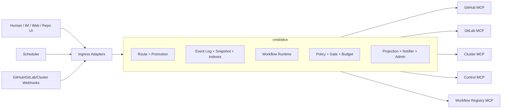

# TDR 00: 系统总览与模块划分

## 1. 目标

本文冻结 Alice v1 的系统总览，回答四个实现级问题：

- 核心运行时和 MCP 应如何拆分二进制
- 包级模块边界和依赖方向是什么
- 从外部输入到 durable 执行的主链路是什么
- 编码时应先实现哪些模块，避免返工

本文是后续 TDR 的导航文档，不重复展开字段细节；对象字段、事件封套、MCP 报文、workflow runtime 会在后续文档细化。

## 2. 设计摘要

Alice v1 采用：

- 单主二进制核心运行时
- 独立 MCP 进程/服务
- JSONL 事件日志做真源
- `EphemeralRequest + PromotionDecision + DurableTask + WorkflowBinding` 做核心对象基线
- workflow manifest + runtime 承载业务流程
- `outbox + MCP` 承载所有外部副作用

从第一性原理看，v1 的关键不是“让 agent 更聪明”，而是让系统先具备：

- 稳定的治理边界
- 清晰的 durable / non-durable 分流
- 不漂移的 workflow 绑定
- 可恢复的副作用链路
- 可审计的人类介入点

## 3. 进程拓扑

### 3.1 二进制清单

第一版建议至少保留以下入口：

```text
cmd/alice
cmd/mcp-github
cmd/mcp-gitlab
cmd/mcp-cluster
cmd/mcp-control
cmd/mcp-workflow-registry
```

其中：

- `cmd/alice` 是唯一真实状态持有者
- `cmd/alice` 同时承载 `serve` 与 CLI client mode
- MCP 二进制不持有任务真状态
- 外部平台的状态变化只有回流 BUS 后才算完成

### 3.2 高层上下文图



## 4. 模块边界

### 4.1 包级目录映射

| 目录 | 责任 | 不能做什么 |
| --- | --- | --- |
| `cmd/alice` | 参数解析、配置装配、服务启动 | 不写业务决策 |
| `internal/cli` | CLI client mode 的命令树、HTTP client、输出渲染 | 不旁路 HTTP 直接连 BUS/store |
| `internal/app` | 依赖装配、生命周期、worker 注册 | 不做领域状态推进 |
| `internal/domain` | 核心对象、命令、事件、不变式 | 不依赖 IO |
| `internal/bus` | 分片执行、路由、命令处理、状态推进 | 不直接访问外部系统 |
| `internal/store` | JSONL 日志、快照、bbolt 物化层、重放 | 不做策略判断 |
| `internal/ingress` | Feishu/Web/GitHub/GitLab/Scheduler 输入适配 | 不跳过 BUS 直接改状态 |
| `internal/policy` | promotion、workflow 归属、gate、预算、重试策略 | 不自己持久化对象 |
| `internal/workflow` | manifest 加载、binding、step runtime、gate runtime | 不绕过 `outbox` 直接写外部系统 |
| `internal/agent` | `Reception` 和 step 执行适配 | 不原地修改聚合根 |
| `internal/mcp` | MCP 客户端、域适配器、断路器、限流 | 不决定业务是否放行 |
| `internal/ops` | 只读投影、通知、巡检、admin API | 不成为真源 |
| `internal/platform` | `slog`、clock、ID、auth、HTTP 基础设施 | 不写业务规则 |

### 4.2 依赖方向

统一依赖方向如下：

```text
cmd -> app
cmd -> cli
app -> platform + store + bus + ingress + workflow + policy + mcp + ops
cli -> platform
cli -> api client
bus -> domain + store + policy + workflow
workflow -> domain + policy + agent
ingress -> domain + bus + platform
mcp -> domain + platform
ops -> store + bus + platform
domain -> no internal dependency
```

强约束：

- `internal/domain` 不依赖 `internal/store`、`internal/mcp` 或 `internal/agent`
- `internal/bus` 不直接 import 某个具体 MCP 域实现
- `internal/agent` 只能返回结构化结果，不能回写真状态
- `internal/ops` 只读事件和投影，不成为第二真源
- CLI client mode 只能走已冻结的 ingress/admin/read-model API，不能读写 `data/` 目录

## 5. 核心运行时职责

`cmd/alice` 的固定职责只有这些：

- 接收并标准化 `ExternalEvent`
- 按确定性路由键命中 request/task 或创建新 `EphemeralRequest`
- 生成并持久化 `PromotionDecision`
- 在满足条件时 promote 为 `DurableTask`
- 绑定 workflow manifest revision
- 运行 step、gate、预算、等待人类和回退逻辑
- 通过 `outbox + MCP` 发出外部副作用
- 维护只读投影、运维指标和恢复流程

作为同一二进制的另一种运行模式，CLI client mode 的固定职责只有：

- 把消息、结构化测试事件或 schedule fire 提交给 ingress/admin API
- 读取 request/task/schedule/event/ops 等只读投影
- 触发受控的审批、等待恢复、取消和恢复工具

CLI client mode 不持有真状态，也不引入第二套路由、恢复或调度逻辑。

`cmd/alice` 不固定这些内容：

- 某类任务一定有哪些业务步骤
- 某一步一定用哪个模型
- PR、实验、控制面变更一定走某个 Go 枚举状态

## 6. 主链路

### 6.1 请求主链路

```text
ExternalEvent
  -> route existing object or create EphemeralRequest
  -> Reception produces PromotionDecision
  -> policy decides:
       direct answer
       or promote to DurableTask
  -> if promoted:
       choose unique workflow candidate
       bind WorkflowBinding
       run step runtime
```

### 6.2 外部副作用主链路

```text
step runtime
  -> OutboxRecordQueued
  -> outbox dispatcher
  -> MCP action
  -> webhook / action receipt
  -> BUS write-back
  -> projection update
```

### 6.3 人类介入主链路

```text
approval card / web action / repo comment
  -> ExternalEvent
  -> deterministic route
  -> validate gate/task still active
  -> record audit
  -> resume / rewind / reject / cancel
```

## 7. 数据与协议边界

### 7.1 核心持久化边界

只有事件日志 append 成功，状态推进才算提交成功。

这意味着：

- `DurableTask` 顶层状态不是数据库表真源
- `outbox pending` 不是独立提交边界
- dedupe、route index、投影即使损坏，也必须能由事件重建

### 7.2 外部协议边界

v1 明确使用：

- 核心 HTTP API：`net/http` + JSON
- MCP 调用：HTTP/JSON
- workflow manifest：YAML
- schema：JSON Schema

不在 v1 同时引入：

- gRPC
- protobuf
- 消息队列中间件
- 关系数据库作为状态真源

## 8. 与 CDR 的承接关系

TDR 的承接方式应保持简单：

- CDR 说“什么对象存在、边界是什么”
- TDR 说“这些对象怎样落到 Go 包、文件、接口和协议”

CLI 在这里的定位也保持一致：

- CDR/TDR 定义哪些对象、事件和恢复动作存在
- CLI 只是这些对象和动作的一个薄门面

如果实现里又重新发明：

- `RouteDecision`
- 固定 `planning/coding/merge` 顶层状态
- 入口直接建 `Task`
- scheduler 旁路建 task

那就说明实现正在偏离 CDR，不是“落地细化”。

## 9. 推荐实现顺序

最短路径如下：

1. `internal/platform`、`internal/store`、`internal/app`
2. `internal/domain`、`internal/bus`
3. `internal/ingress`、`internal/policy`
4. `internal/workflow`
5. `internal/mcp`
6. `internal/ops`
7. 再补默认 workflow manifest 和 admin 工具

先做内核，再做 workflow；先让 durable 边界和恢复成立，再让 agent 真正做事。
