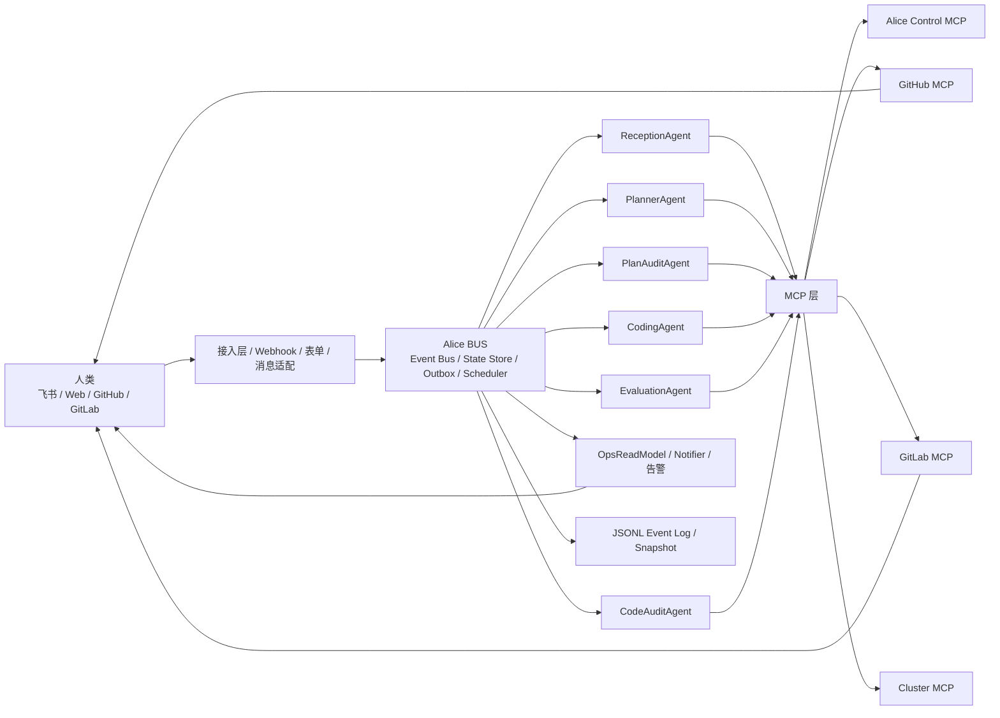
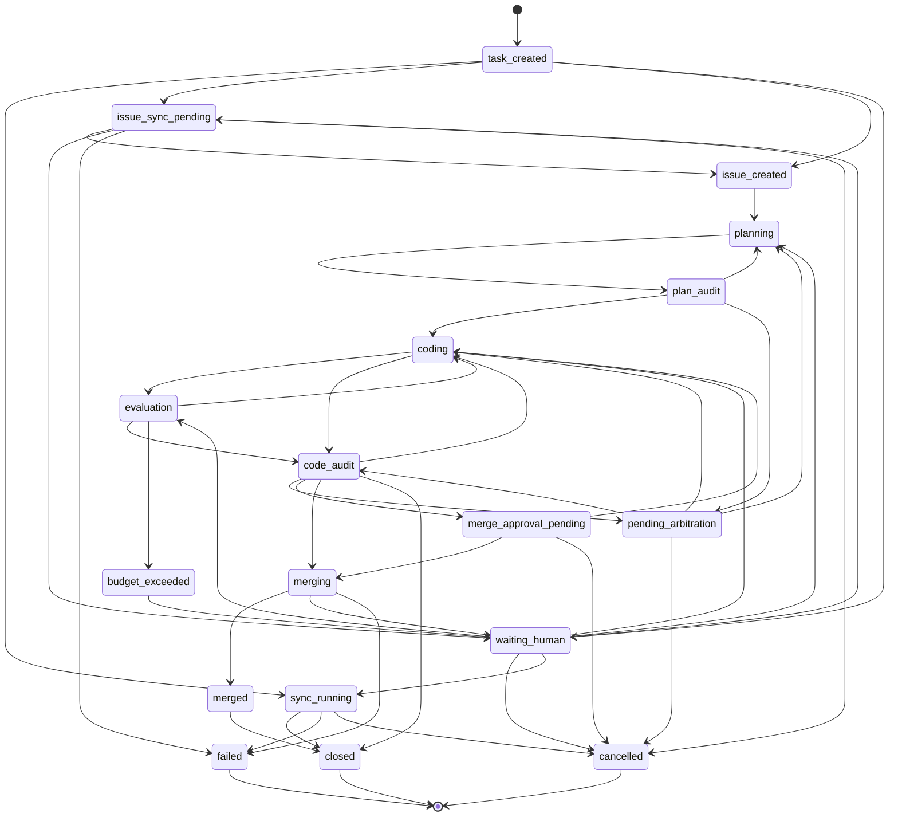

# Alice 技术设计报告（TDR）

## 1. 文档定位

本文是 Alice 第一版系统的统一技术设计报告。可以把它理解为“根据 `docs/cdr/` 写出的技术设计文档”：它把 `docs/` 下已经存在的草案与概念设计继续收敛成一份可评审、可落地、可继续拆分 ADR 的总设计。

本文基于以下文档整理：

- [`docs/draft.md`](../draft.md)
- [`docs/cdr/README.md`](../cdr/README.md)
- [`docs/cdr/entry_processing_detail.md`](../cdr/entry_processing_detail.md)
- [`docs/cdr/issue_workflow_detail.md`](../cdr/issue_workflow_detail.md)
- [`docs/adr/README.md`](../adr/README.md)

本文目标是统一：

- 系统边界与总体架构
- 关键组件职责
- 统一状态机与对象模型
- 一致性、恢复、预算、审批与安全约束
- 第一版实现范围与后续 ADR 拆分方向

本文不是 Prompt 设计、接口字段规范或数据库表结构设计文档。

## 1.1 详细设计目录

本目录在本文件之下继续拆分为可直接指导编码实现的详细设计文档：

- [00-system-overview.md](./00-system-overview.md)：系统边界、进程拓扑、代码目录映射与启动顺序
- [01-domain-model.md](./01-domain-model.md)：核心对象、状态机、命令/事件、领域不变式
- [02-app-bootstrap-and-runtime.md](./02-app-bootstrap-and-runtime.md)：`cmd/alice` 启动装配、配置、生命周期与 goroutine 模型
- [03-bus-state-store-and-projections.md](./03-bus-state-store-and-projections.md)：BUS、State Store、事件日志、快照、投影、背压与恢复
- [04-ingress-reception-and-confirmation.md](./04-ingress-reception-and-confirmation.md)：多入口接入、ReceptionAgent、身份校验与确认令牌
- [05-outbox-and-mcp.md](./05-outbox-and-mcp.md)：`outbox`、MCP 协议落地、幂等、重试与断路器
- [06-planning-and-plan-audit.md](./06-planning-and-plan-audit.md)：Planner、计划审核、审核聚合与人工仲裁
- [07-coding-evaluation-and-merge.md](./07-coding-evaluation-and-merge.md)：编码、评测、代码审核、合并与预算控制
- [08-ops-scheduler-and-recovery.md](./08-ops-scheduler-and-recovery.md)：OpsReadModel、通知、scheduler、自检巡检与故障恢复

如果开始写代码，建议按上述顺序阅读。

## 1.2 建议代码模块映射

详细 TDR 默认采用以下实现目录映射：

- `cmd/alice/`：核心运行时主程序
- `internal/app/`：启动装配、生命周期、依赖注入
- `internal/domain/`：领域模型、命令、事件、状态名与校验
- `internal/bus/`：任务执行器、命令处理、状态推进
- `internal/store/`：事件日志、快照、投影、去重、`outbox`
- `internal/ingress/`：飞书、Web、GitHub、GitLab 接入与标准化
- `internal/agent/`：Reception、Planner、Audit、Coding、Evaluation 等 Agent 适配层
- `internal/workflow/`：计划、审核、编码、评测、合并的流程编排
- `internal/mcp/`：MCP 客户端、域适配器、重试、限流与断路器
- `internal/ops/`：展示投影、告警、通知、巡检、scheduler
- `internal/platform/`：配置、日志、时间、ID、鉴权、HTTP/gRPC 基础设施

`pkg/` 在第一版不作为主要落点；除非接口已经稳定且确有跨二进制复用需求。

## 2. 背景与目标

Alice 要解决的是“把多来源的人类请求收敛为可解释、可恢复、可审计的任务执行系统”。

第一版需要同时覆盖两类场景：

- 同步闭环任务：轻量查询、单步控制、只读分析
- 异步代码任务：需求澄清、计划、审核、编码、可选评测、代码审核、合并与关闭

系统设计目标如下：

- 以 BUS 为真实状态源，而不是把外部协作平台当作状态真源
- 对代码任务建立统一、可回退、可审计的状态机
- 将外部副作用统一纳入幂等、可恢复的执行链路
- 对高风险动作、预算和评测资源施加硬约束
- 让人类在飞书、Web、Issue、PR 等界面中进行可控介入
- 在第一版优先保证可解释、可恢复、可观测，而不是追求高度动态编排

第一版明确不追求：

- 分布式多节点 BUS
- 高度自治的多 Agent 自由协商编排
- 以 GitHub / GitLab Issue、PR 状态替代系统内状态
- 复杂非代码任务的统一长流程编排

## 3. 总体设计原则

### 3.1 BUS 是系统真实状态

- `BUS` 统一指 Alice 核心运行时，而不是狭义消息队列
- BUS 内部概念上分为 `Event Bus` 与 `State Store`
- 一切真实状态推进必须经过 `State Store`
- Issue、PR、评论、飞书卡片、Web 表单是协作界面和外部事件来源，不是状态真源

### 3.2 单任务串行与版本绑定

- 同一 `task_id` 的事件按顺序串行处理
- `task_version` 用于单任务乐观锁和并发写保护
- `global_hlc` 与 `parent_event_id` 预留给跨任务因果追踪和后续分布式扩展
- 计划审核必须绑定 `plan_version`
- 代码审核必须绑定 `pr_head_sha`
- 版本变化后，旧审核、旧评测、旧仲裁结论只能保留审计价值，不再推进主流程

### 3.3 外部事件按至少一次处理

- Webhook、评论、Review、审批回执都必须先验签，再去重，再入 BUS
- 外部事件必须携带稳定 `event_id`
- 去重索引必须可持久化加速，但真源仍是事件日志
- Alice 自己发出的评论、Review、PR 状态变更的回流事件只用于回执确认和镜像同步，不再次触发同类 Agent

### 3.4 外部副作用统一走 outbox

- 所有外部副作用都先在事件日志中提交 `OutboxActionCreated`
- 再由可重建的 `outbox` 队列派发
- 之后再通过 MCP 执行
- 成功或失败都必须回写 BUS
- 幂等键必须成为 MCP 协议契约的一部分，并透传到底层执行器

### 3.5 安全、预算和人工确认优先于自动推进

- 高风险动作默认不因自然语言请求直接执行
- 预算不是展示字段，而是状态机约束
- 审核冲突默认按不通过处理
- 第一版默认采用保守策略，把失败、回退和等待人类视为正常设计能力

## 4. 架构总览

### 4.1 部署形态

第一版采用单二进制核心系统加独立 MCP 进程/服务的结构：

- Alice 核心 BUS、任务状态机、Webhook、scheduler、去重、`outbox`、告警内置在单二进制中
- 各类 MCP 在本仓库内分别实现、分别构建、分别运行
- Agent 逻辑作为 BUS 消费者挂接在核心运行时之上

### 4.2 高层上下文图



### 4.3 组件职责

| 组件 | 职责 |
| --- | --- |
| 接入层 | 接收飞书、Web、Git 平台事件，完成验签、格式统一和初始上下文封装 |
| BUS / State Store | 管理真实任务状态、对象版本、事件推进、恢复与只读投影 |
| `ReceptionAgent` | 识别意图、整理上下文、产出建议性 `RouteDecision` |
| `PlannerAgent` | 从 issue 和代码上下文生成 `PlanArtifact` 与 `EvalSpec` |
| `PlanAuditAgent` | 针对指定 `plan_version` 进行独立审核 |
| `CodingAgent` | 根据通过计划编码，创建或更新唯一活动 PR |
| `EvaluationAgent` | 基于 `pr_head_sha + EvalSpec` 执行评测并回写结果 |
| `CodeAuditAgent` | 针对指定 `pr_head_sha` 做代码审核和合并门禁判断 |
| Git 平台桥接层 | 维护 issue / PR 绑定、评论回执、外部状态镜像 |
| `UsageLedger` | 统计 token、模型费用和 CPU/GPU 消耗，并驱动预算决策 |
| `OpsReadModel` | 输出任务进度、预算、MCP 健康、队列积压等只读视图 |
| `Notifier` | 飞书卡片、消息推送、人工仲裁与审批通知 |

## 5. 核心对象模型

| 对象 | 作用 |
| --- | --- |
| `Task` | BUS 中被正式管理的任务实体，承载状态、版本、来源、风险、关联对象与取消令牌 |
| `UserRequest` | 来自飞书、Web 等入口的人类请求抽象 |
| `IssueEvent` / `ExternalEvent` | 来自 issue、PR、评论、Review、审批回执等外部事件 |
| `IngressTrace` | 入口审计轨迹，记录 `received`、`classified` 等前置阶段，不进入 `Task` 主状态机 |
| `RouteDecision` | `ReceptionAgent` 产出的建议性分流结果，包含稳定业务类型与瞬时执行路径 |
| `ExternalIssueBinding` | `task_id` 与外部 issue 的绑定关系 |
| `PlanArtifact` | 规划结果，包含 `plan_artifact_id` 与 `plan_version` |
| `AuditRequest` | 对某一目标版本发起审核的控制对象，固定轮次、席位、截止时间和租约 |
| `AuditVerdict` / `AuditRecord` | 审核结论及理由摘要 |
| `PRArtifact` | 当前活动 PR 及 `pr_head_sha`、可合并性等元数据 |
| `EvalSpec` | 评测规格，定义阈值、预算、资源、数据集版本和随机种子策略 |
| `EvalResult` | 对指定 `pr_head_sha` 的结构化评测结果 |
| `Confirmation` | 一次性人工确认对象，绑定 `confirmation_id`、`confirmation_token` 与鉴权快照 |
| `ArbitrationRequest` | 连续 3 轮审核分歧后的人工仲裁请求 |
| `CancellationToken` | 跨 Agent 与 MCP 的取消传播凭证 |
| `UsageLedger` | 任务级预算、模型费用、资源用量账本 |
| `OutboxAction` / `OutboxRecord` | 待执行或待恢复的外部副作用记录 |
| `ScheduledTask` | 由 scheduler 触发的定时任务定义 |
| `ScheduleFire` | 定时任务每次触发的稳定实例键，用于补偿重放与幂等创建 |
| `StatusUpdate` | 各阶段统一回写的状态推进事件 |

## 6. 状态模型

### 6.1 统一状态命名

本文统一采用 `docs/cdr` 中已经收敛的 snake_case 状态名，作为第一版实现命名基线。

`received` 与 `classified` 只属于 `IngressTrace`，不是 `TaskStatus`。

入口完成后的任务前缀状态：

- `task_created`
- `waiting_human`
- `sync_running`
- `issue_sync_pending`
- `issue_created`

代码任务主流程状态：

- `planning`
- `plan_audit`
- `coding`
- `evaluation`
- `budget_exceeded`
- `code_audit`
- `pending_arbitration`
- `merge_approval_pending`
- `merging`
- `merged`
- `closed`
- `failed`
- `cancelled`

### 6.2 状态语义

| 状态 | 语义 |
| --- | --- |
| `task_created` | BUS 已创建或绑定正式任务，后续流程都有稳定 `task_id` |
| `waiting_human` | 等待信息补充、风险确认、预算决策或恢复处理，必须携带 `waiting_reason` |
| `issue_sync_pending` | 内部任务已存在，但外部 issue 镜像尚未建立完成 |
| `issue_created` | 任务已绑定外部 issue，进入 issue 驱动工作流 |
| `plan_audit` | 对特定 `plan_version` 聚合审核结论 |
| `evaluation` | 对特定 `pr_head_sha + EvalSpec` 执行客观评测 |
| `budget_exceeded` | 命中预算或资源硬上限，自动推进暂停 |
| `pending_arbitration` | 连续 3 轮审核分歧后等待人工仲裁 |
| `merge_approval_pending` | 代码审核通过，但等待人工合并审批 |
| `merged` | 外部合并已完成，但 issue 收口和通知尚未全部结束 |

### 6.3 生命周期总览



## 7. 关键工作流

### 7.1 入口分流工作流

所有入口请求都遵循统一原则：

1. 接入层生成 `UserRequest` 或 `ExternalEvent`
2. 记录入口审计轨迹 `received -> classified`
3. `ReceptionAgent` 产出 `RouteDecision`
4. BUS 创建或绑定正式 `Task`
5. 按建议路径进入同步、等待人工或异步代码通道

`RouteDecision` 由“稳定业务类型 + 瞬时执行路径”组成；其中执行路径在 TDR 层细化为五种实现结果：

- `sync_direct`
- `sync_mcp_read`
- `control_write`
- `async_issue`
- `wait_human`

边界策略如下：

- 简单查询和单步控制优先走同步
- `Task.Type` 是稳定业务类型，`RouteDecision.Route` 只用于入口后的第一跳分流
- 明确代码修改、调试、测试、构建、仓库操作统一走 `async_issue`
- 信息不足、高风险副作用或复杂多步编排优先进入 `waiting_human`
- 非代码但复杂的长期任务不强行塞入 issue 工作流

### 7.2 Issue 驱动代码工作流

代码任务的主流程为：

1. 任务进入 `issue_created`
2. `PlannerAgent` 生成 `PlanArtifact` 与可选 `EvalSpec`
3. `PlanAuditAgent` 针对 `plan_version` 审核
4. 审核通过后，`CodingAgent` 创建或更新唯一活动 PR
5. 需要评测则进入 `evaluation`，否则直接进入 `code_audit`
6. 代码审核通过后，若 `DeliveryMode=merge` 则进入 `merge_approval_pending` 或 `merging`；若 `DeliveryMode=report_only` 则直接收口关闭
7. 合并与 issue 收口完成后进入 `closed`

### 7.3 审核聚合与仲裁工作流

计划审核和代码审核共享同一套机制：

- 每轮审核先生成 `AuditRequest`
- `AuditRequest` 必须固定目标版本、轮次、审核席位、截止时间和心跳租约
- 审核 Agent 接单后先回写 `accepted`，再发送处理中心跳
- BUS 仅在以下条件之一满足时聚合本轮结论：
  - 收齐全部 verdict
  - 未完成席位租约失效并被判定缺席
  - 截止时间到达

聚合规则：

- 通过则进入下一阶段
- 打回则回到上一个执行阶段
- 结论不一致时，前 2 轮按不通过处理
- 连续 3 轮仍不一致，进入 `pending_arbitration`

### 7.4 评测与预算工作流

只有被策略标记 `requires_evaluation` 的任务才会进入评测阶段。

评测链路要求：

- `EvalSpec` 在计划阶段生成
- 评测目标绑定当前 `pr_head_sha`
- 评测结果只对当前 `pr_head_sha + EvalSpec` 生效
- 预算或资源命中硬上限后，BUS 必须停止新的 `coding` / `evaluation` 投递
- 已运行的评测作业需要通过 Cluster MCP 尝试终止

人类恢复策略：

- 仅追加预算或恢复资源，且代码与 `EvalSpec` 未变时，可直接从 `waiting_human` 回到 `evaluation`
- 改变目标、指标、数据集或方向时，应回到 `planning`
- 改变实现但不改变目标时，应回到 `coding`

### 7.5 合并与关闭工作流

代码审核通过不等于已合并。

后续还需要判断：

- CI 是否通过
- 分支保护是否满足
- 仓库策略是否要求额外合并审批
- 当前任务是否属于“只产出报告，不合入主干”

只有合并动作完成后，任务才能进入 `merged`；收尾通知和 issue 关闭完成后，才能进入 `closed`。

## 8. 一致性、幂等与恢复设计

### 8.1 持久化模型

第一版持久化采用：

- JSONL 追加事件日志
- 周期性快照
- 可重建的外部事件 dedupe 索引
- 可重建的 `outbox` 队列
- 持久化 `ScheduledTask`

恢复流程为：

1. 加载最新快照
2. 重放后续 JSONL 事件
3. 校验对象版本
4. 扫描 `outbox`、审核、外部作业并执行恢复对账

设计目标：

- `RPO <= 1 分钟`
- `RTO <= 5 分钟`

### 8.2 幂等规则

- Webhook 和外部回执按稳定 `event_id` 去重
- `outbox` 动作按幂等键去重
- 飞书卡片与 Web 审批动作必须绑定 `confirmation_id + confirmation_token`
- 重复点击只返回“已处理/已失效”，不能重复触发副作用

推荐 MCP 幂等键基线：

```text
task_id:event_id:action_type
```

### 8.3 恢复与对账

对账对象至少包括：

- 长时间 `pending` 的 `OutboxAction`
- 长时间无结果回写的评测作业
- 外部 issue / PR 状态与 BUS 状态不一致的任务

系统恢复原则：

- 以 BUS 为准恢复镜像状态
- 尽量补写缺失回执，而不是重复制造副作用
- 对不可自动恢复的差异，转入 `waiting_human` 或告警链路

### 8.4 背压

当分片队列或写入队列超过阈值时，BUS 必须进入背压。

背压期策略：

- 暂停低优先级 webhook 和新任务
- 允许高优先级确认、取消和恢复事件优先进入
- 持续输出告警直到积压缓解

## 9. 安全与治理设计

### 9.1 受限执行边界

- 所有涉及仓库、凭据、系统设置的 Agent 都运行在受限沙箱中
- 外部系统访问统一通过 MCP
- 同机通信优先 Unix Domain Socket
- 跨机通信优先 gRPC

### 9.2 高风险动作控制

高风险动作至少包括：

- 修改设置
- 修改记忆
- 创建高影响定时任务
- 集群敏感操作
- 合并 PR

控制规则：

- 自然语言只用于识别候选意图，不能直接成为执行指令
- 身份统一映射到内部 `alice_user_id`
- 必要时要求更高权限或 MFA
- `Confirmation` 必须绑定 `task_id`、`action_hash`、确认人身份和过期时间

### 9.3 评测安全

- `evaluation` 默认网络隔离
- 只允许访问白名单制品、模型和数据源
- 进入评测前需做基础静态扫描与策略校验
- 危险调用、越权系统调用、明显网络外发风险应被拦截

## 10. 可观测性与运维

### 10.1 只读展示

展示区只读取 `OpsReadModel`，不直接修改 BUS 状态。

展示区至少应展示：

- 当前任务状态与阻塞原因
- `task_id`
- `plan_version`
- `pr_head_sha`
- 预算剩余
- token 与模型费用
- CPU / GPU 资源消耗
- BUS 健康状态
- MCP 健康状态
- 队列积压情况

### 10.2 通知与人工介入

第一版人工操作面优先级：

1. 飞书卡片与按钮
2. Web 管理页
3. Issue / PR 评论补充说明

这些入口统一回写 BUS，而不是直接改外部平台状态。

### 10.3 自检与故障上报

系统需要周期性巡检：

- 长时间 `pending` 的 `outbox`
- 长时间未结束的审核轮次
- 长时间无回写的评测作业
- MCP 心跳、限流状态与断路器

上报原则：

- 瞬时错误优先有限重试
- 基础设施故障优先停止危险动作并上报
- 长时间无收敛任务优先生成阶段性报告，而不是无限重试

## 11. 第一版实现边界

### 11.1 明确纳入第一版

- 单二进制 BUS
- JSONL + Snapshot 持久化
- 统一 `Task` 状态机
- 入口分流与 issue 镜像
- 计划审核、代码审核、人工仲裁
- 可选评测与预算硬熔断
- `outbox`、幂等、恢复与对账
- 飞书 / Web 人工确认链路
- 只读展示区与基础告警

### 11.2 暂不纳入第一版

- 分布式多节点 BUS
- 复杂非代码长流程编排
- 高度动态的多 Agent 自治调度
- 将状态存储直接切换到外部数据库作为唯一实现
- 复杂权限系统之外的细粒度企业级 IAM 平台集成

## 12. ADR 拆分建议

根据 `docs/adr/README.md`，本 TDR 之后应优先沉淀以下 ADR：

1. `choose-state-store`
   决定第一版状态存储是否坚持 JSONL + Snapshot，以及何时引入 SQLite / BoltDB。
2. `define-mcp-idempotency-key`
   固化 MCP 幂等键格式、透传方式与失败恢复约束。
3. `snapshot-and-recovery-strategy`
   固化快照触发条件、恢复顺序、对账对象与恢复窗口目标。
4. `audit-aggregation-policy`
   固化审核席位、缺席判定、租约长度、轮次阈值与冲突聚合策略。
5. `budget-and-evaluation-guardrails`
   固化预算核算口径、熔断阈值、评测恢复条件与作业终止策略。

## 13. 结论

Alice 第一版的核心设计可以概括为：

- BUS 是真实状态源，Issue / PR / 评论是协作表面和事件入口
- 所有入口请求先进入 BUS，再决定同步闭环、等待人工或异步代码流程
- 代码任务按 `planning -> plan_audit -> coding -> evaluation? -> code_audit -> merge_approval_pending?/merging -> closed` 推进，`report_only` 任务则在 `code_audit` 通过后直接 `closed`
- 审核、评测、仲裁和预算都绑定明确版本，不允许旧结论穿透到新版本
- 所有外部副作用统一纳入 `outbox + 幂等键 + MCP` 的恢复式执行模型
- 第一版优先保证可解释、可恢复、可观测和可审计

这份 TDR 作为当前 `docs/` 设计的统一上位文档，后续变更应优先更新 ADR，再回补实现与细化设计。
